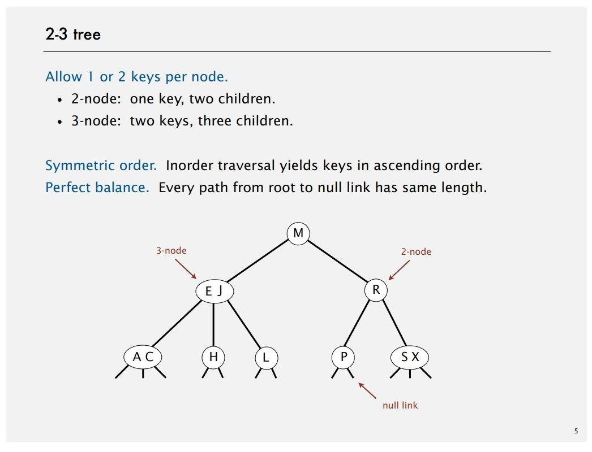
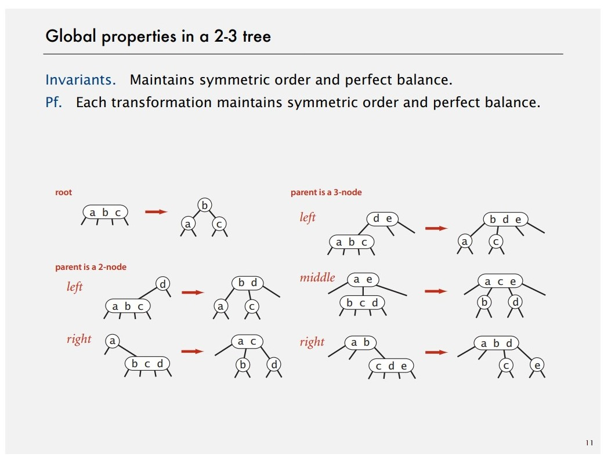
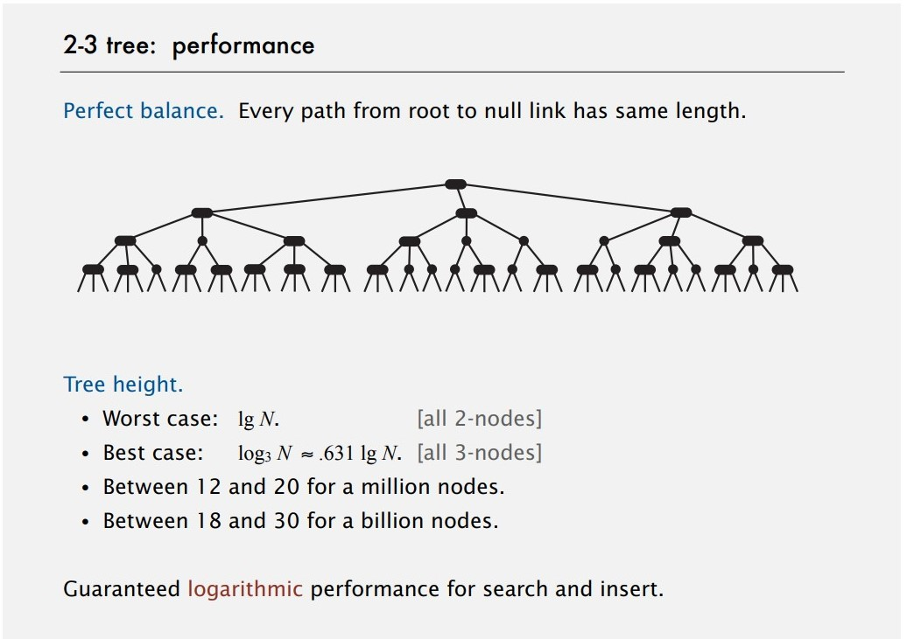
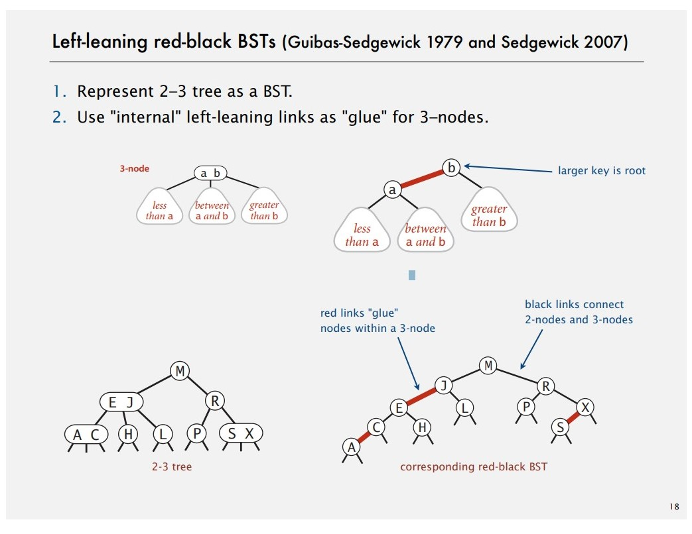
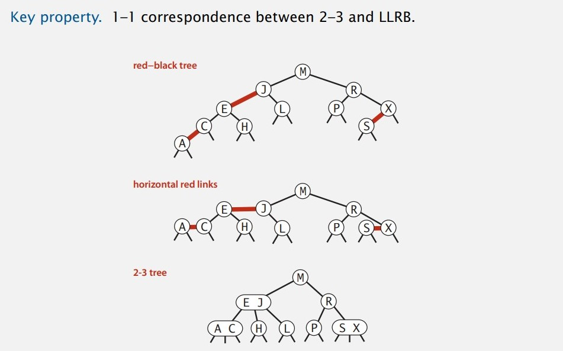
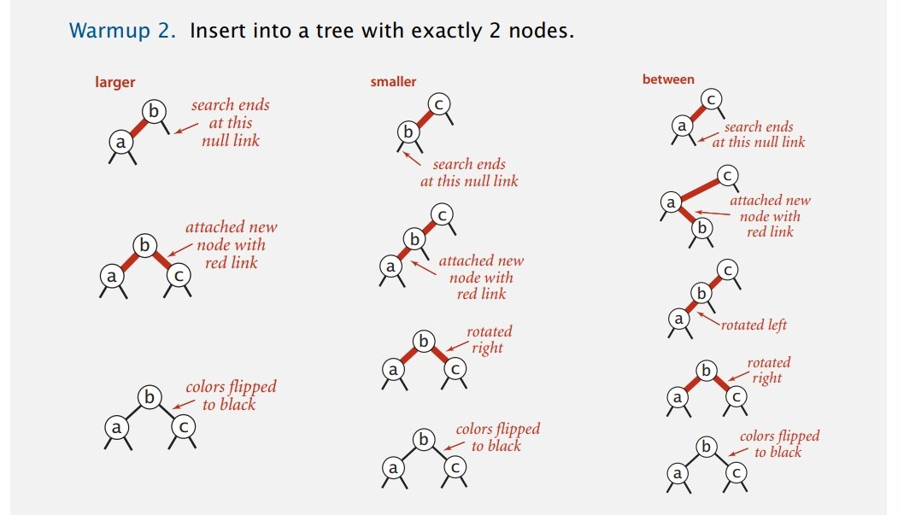
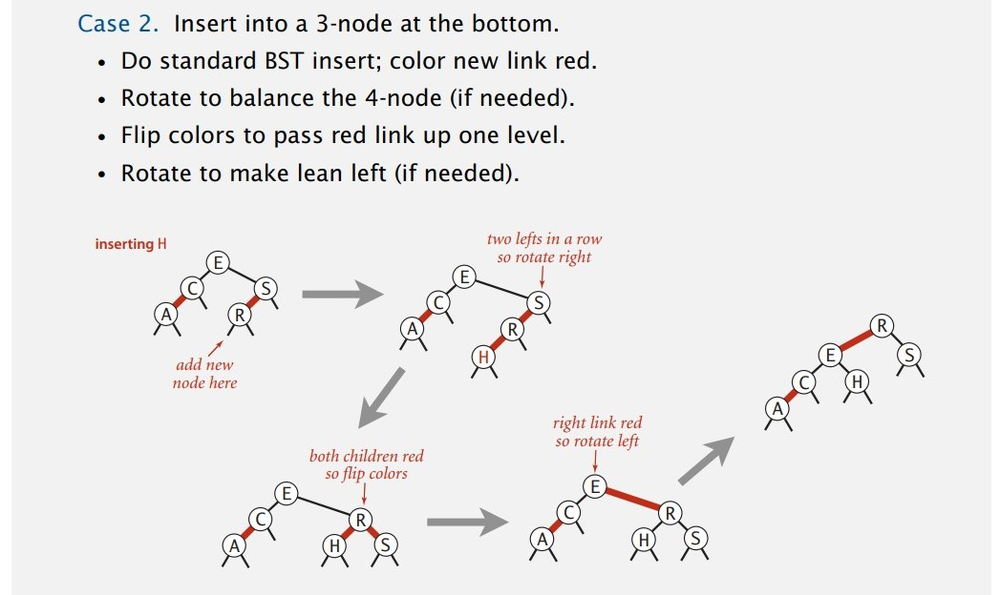
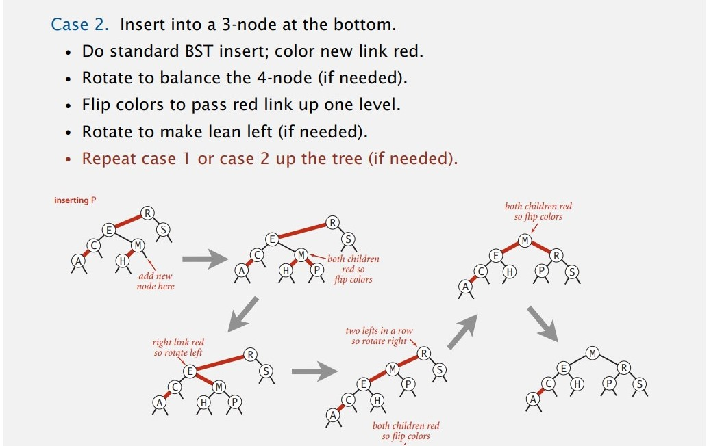
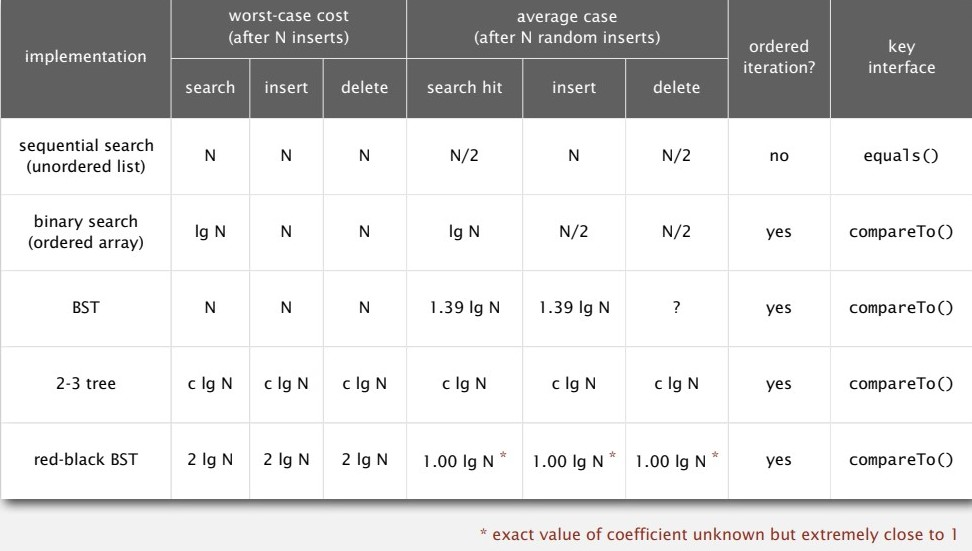

# Balanced Search Trees

To find a symbol table implementation that guarantee performance of search hit, insert, delete operations in $O(logN)$ even in worst cases. Thus, we introduce three types of balanced search trees, 2-3 trees, left-leaning red-black BSTs, B-trees.

## 2-3 search trees

**Search.**

- Compare search key against keys in node.
- Find interval containing search key.
- Follow associated link (recursively).

**Insertion (cope with insertion in 3-node).**

- Add new key to 3-node to create temporary 4-node.
- Move middle key in 4-node into parent.
- Repeat up the tree, as necessary.
- If you reach the root and it's a 4-node, split it into three 2-nodes.

**Local transformation.** Splitting a 4-node only needs constant number of operations.

**Global properties.**



**Performance.**



## Red-black BSTs

### Definition

**Definition.** A BST that:

- No node has two red links connected to it.
- Every path from root to null link had the same number number of black links.
- Red links lean left.

**Correspondence between 2-3 trees and LLRB.**





### Implementation

- **Search.** Identical to elementary BST but runs faster with a better balance.

  ```java
  public Value get(Key key) {
  	Node x = root;
  	while (x != null) {
  		int cmp = key.compareTo(x.key);
  		if (cmp < 0) x = x.left;
  		if (cmp > 0) x = x.right;
  		else return x.val;
  	}
  	return null;
  }
  ```
- **Red-Black BST representation.**

  ```java
  private static final boolean RED = true;
  private static final boolean BLACK = false;
  
  private class Node {
  	Key key;
  	value val;
  	Node left, right;
  	boolean color; // color of parent link
  }
  
  // each node is pointed by precisely one link form its parent
  // tell that link is RED or not
  private boolean isRed(Node x) {
  	if (x == null) retun false; // null links are black
  	return x.color == RED;
  }
  ```
- **Left rotation** (counter clockwise). Orient a (temporarily) right-leaning red link to lean left.

  ```java
  private Node rotateLeft(Node x) {
  	assert isRed(h.right);
  	Node x = h.right;
  	h.right = x.left;
  	x.left = h;
  	x.color = h.color;
  	h.color = RED;
  	return x; 
  }
  ```
- **Right rotation** (clockwise). Orient a left-leaning red link to (temporarily) lean right.

  ```java
  private Node rotateRight(Node h) {
  	assert isRed(h.left);
  	Node x = h.left;
  	h.left = x.right;
  	x.right = h;
  	x.color = h.color;
  	hcolor = RED;
  	return x;
  }
  ```
- **Color flip.** Recolor to split a (temporary) 4-node.

  ```java
  private void flipColor(Node h) {
  	assert !isRed(h);
  	assert isRed(h.left);
  	assert isRed(h.right);
  	h.color = RED;
  	h.left.color = BLACK;
  	h.right.color = BLACK;
  }
  ```
- **Insertion.**

  - Basic strategy. To maintain 1-1 correspondence with 2-3 trees.

    - Right child red, left child black: rotate left.
    - Left child, left-left grandchild red: rotate right.
    - Both children red: flip colors.

  ```java
  private Node put(Node h, Key key, Value val) {
  	if (h == null) return new Node(key, val, RED); // insert at bottom and color RED
  	int cmp = key.compareTo(h.key);
  	if (cmp < 0) h.left = put(h.left, key, val);
  	else if (cmp > 0) h.right = put(h.right, key, val);
  	else h.val = val;
  
  	if (isRed(h.right) && !isRed(h.left)) h = rotateLeft(h); // lean left
  	if (isRed(h.left) && isRed(h.left.left)) h = rotateRight(h); // balance 4-node
  	if (isRed(h.left) && isRed(h.right)) flipColors(h); // split 4-node
  
  	return h;
  }
  ```

  - Discuss by cases.








### Cost summary



## B-trees

(Optional) Refer to slides.
