# Geometric Applications of BSTs

## 1d range search

**Extension of ordered symbol table.**

- Range search: find all keys between k1 and k2.
- Range count: number of keys between k1 and k2.

**Geometric interpretation.**

- Keys are point on a line.
- Find / count points in a given 1d interval.

**Applicaiton.** Database quries.

**Elementary implementations.**

- **Unordered list.** Fast insert, slow range search.
- **Ordered array.** Slow insert, binary search for k1 and k2 to do range search.

  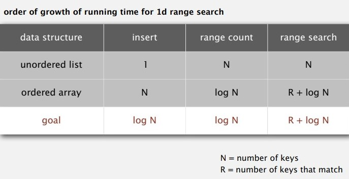

**BST implementations.**

- **1d range count.** How many keys between `lo` and `hi`?

  - Running time proportional to $log(N)$.
  - Nodes examined = search path to `lo` + search path to `hi`.

  ```java
  public int size(Key lo, Key hi) {
  	if (contains(hi)) return rank(hi) - rank(lo) + 1;
  	else return rank(hi) - ranl(lo);
  }
  ```
- **1d range search.** Find all keys between `lo` and `hi`.

  

## Line segment intersection

Given n horizontal and vertical line segments, find all intersections.

Assume all x- and y- coordinates are distinct.

### Sweep-line algorithm

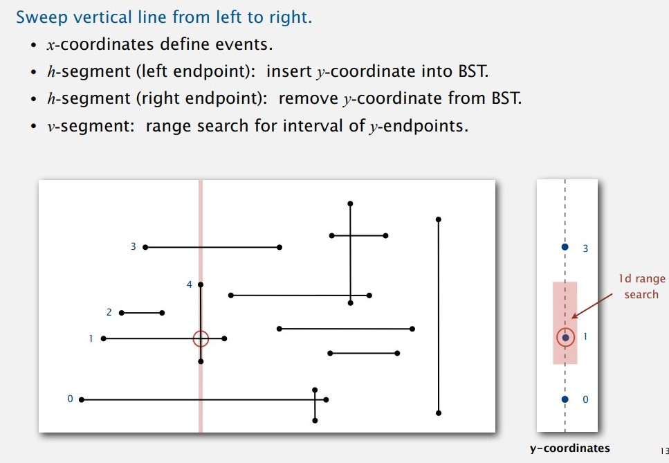

### Sweep-line analysis

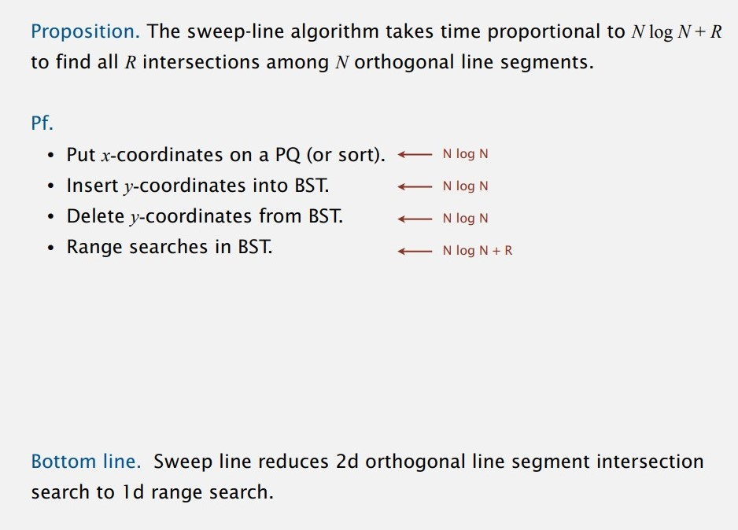

## Kd trees

### 2d orthogonal range search

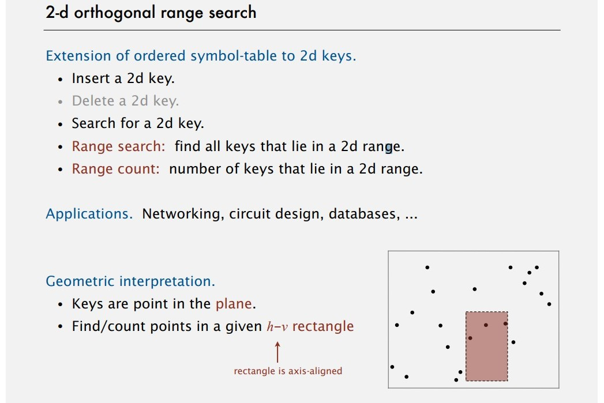

### Grid implementation

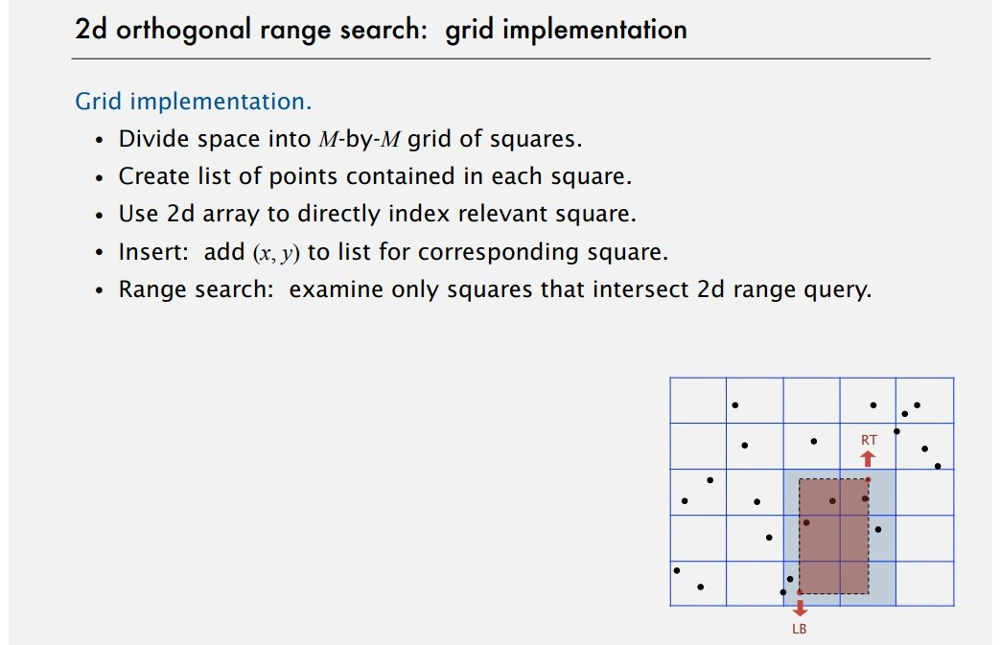


### Clustering

**Grid implementation.** Fast and simple for evenly-distrbuted points.

**Problem.** Clustering, a wellknown phenomenon in geometric data.

- Lists are too long, even though average length is short.
- Need data structure that adapts gracefully to data.

### 2d tree implementation

**2d tree.** Recursively divide space into two halfplanes.

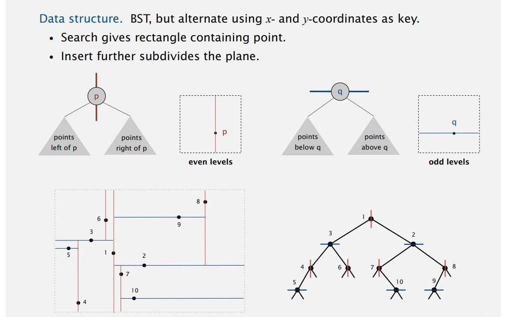

**Goal.** Find all points in a query axis-aligned rectangle.

- Check if point in node lies in given rectangle.
- Recursively search left/bottom (if any could fall in rectangle).
- Recursively search right/top (if any could fall in rectangle).

**Demo**. Refer to slides and videos.

**Time.** Typical case, $R + log(N)$. Worst case, $R + sqrt(N)$.

### Nearest neighbor search in 2d tree

- Check distance from point in node to query point.
- Recursively search left/bottom (if it could contain a closer point).
- Recursively search right/top (if it could contain a closer point).
- Organize method so that it begins by searching for query point

Refer to slides and videos for a detailed explanation.

### Kd tree

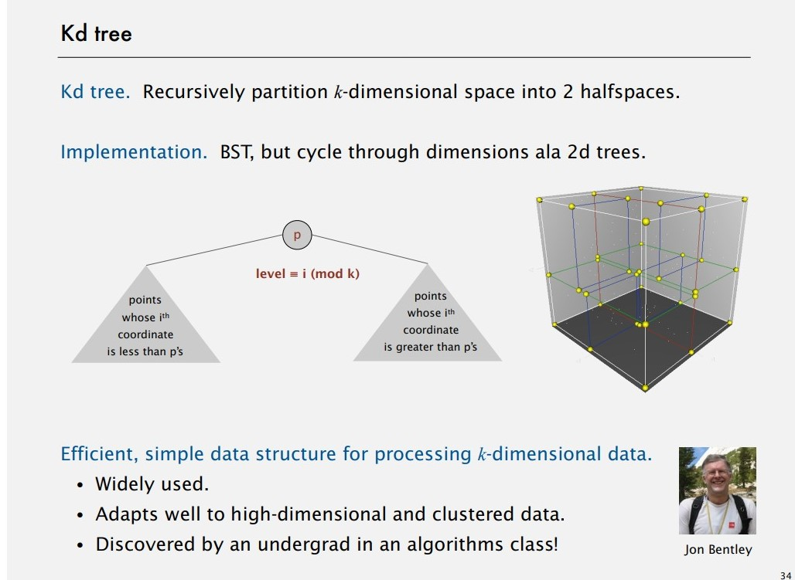

## Interval search trees

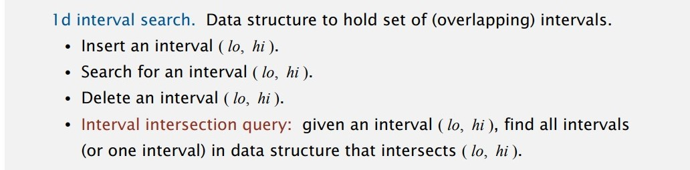

### 1d interval search API

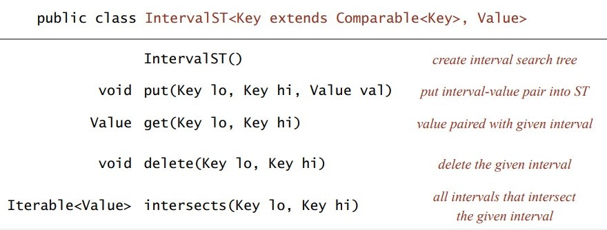

### Interval search trees

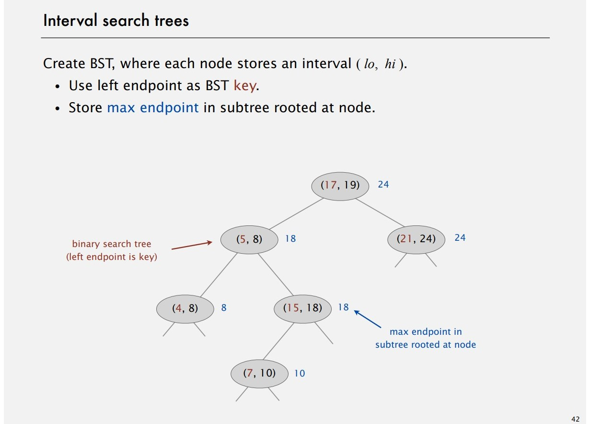

**To insert an interval.**

- Insert into BST, using `lo` as the key.
- Update max in each node on search path.

**To search for intervals that intersect query interval `(lo, hi)`.**

- If interval in node intersects query interval, return it.
- Else if left subtree is null, go right.
- Else if max endpoint in left subtree is less than lo, go right.
- Else go left.

```java
Node x = root;
while (x != null) {
	if (x.interval.intersects(lo, hi)) return x.interval;
	else if (x.left == null) x = x.right;
	else if (x.left.max < lo) x = x.right;
	else 	x = x.left;
}
```

**Search for an intersecting interval analysis**

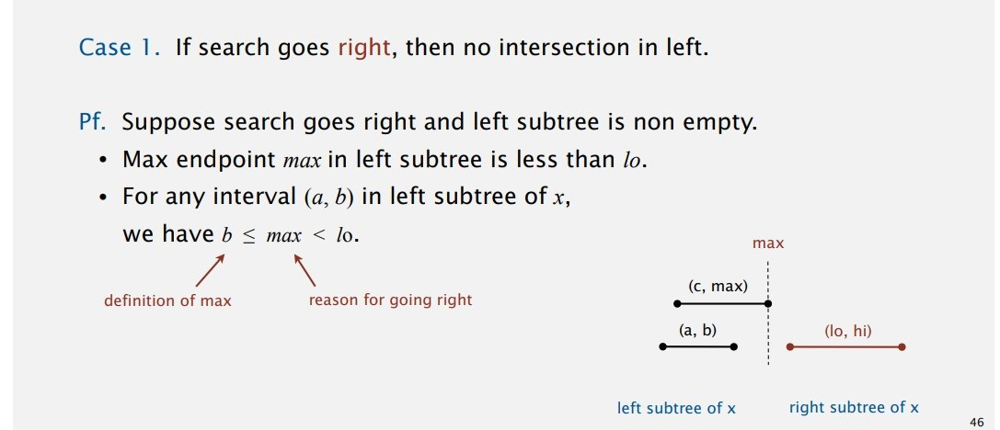

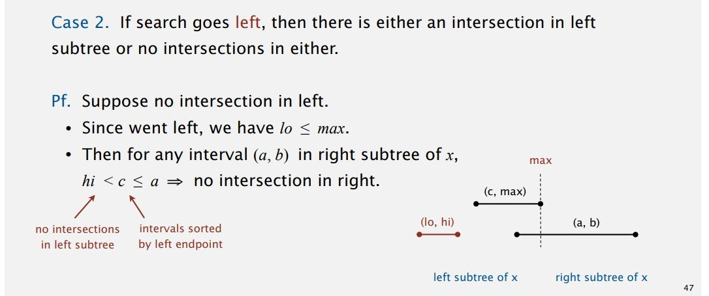

### Analysis

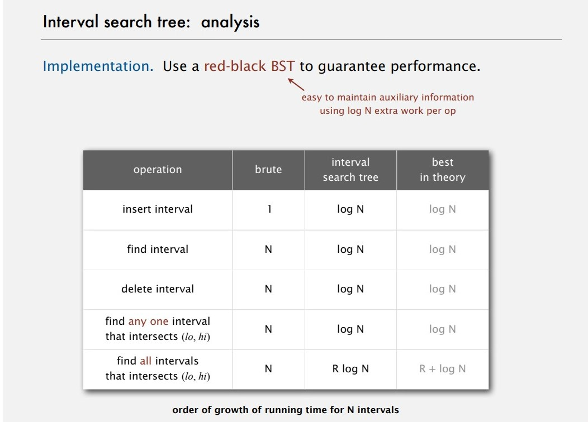

## Rectangle intersection

Find all intersections among a set of N orthogonal rectangles.

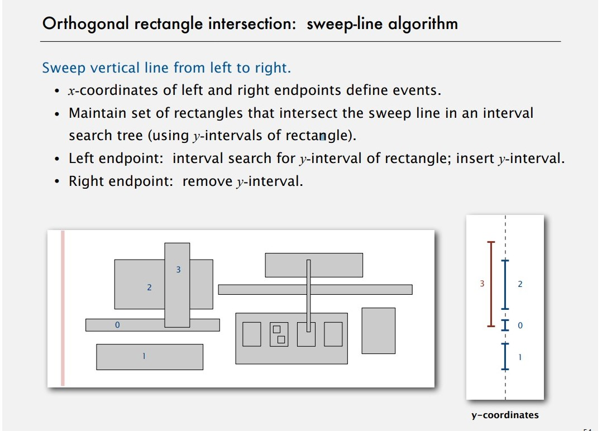

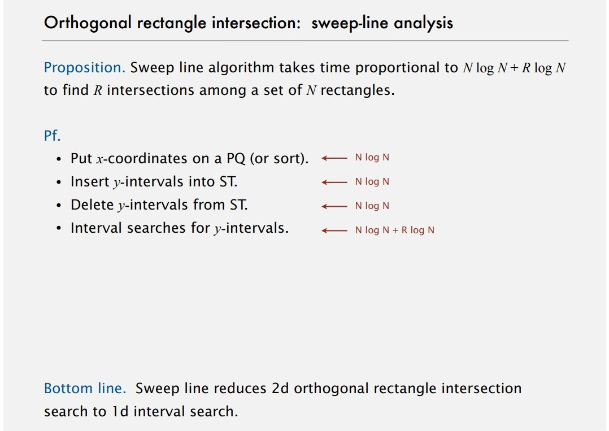

## Summary

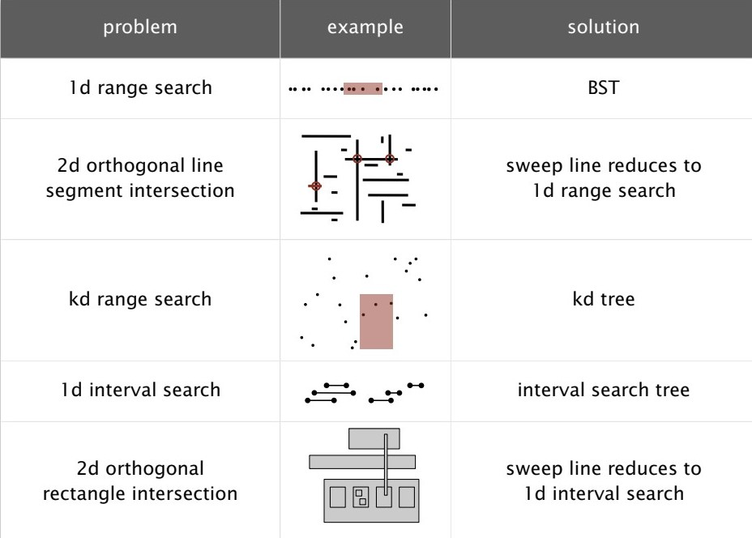
