# Merge Sort

Basic strategy:

- Divide array into two halves
- Recursively sort each other
- Merge two halves

## Mergesort (Top-down)

### Java implementation

```java
public class Merge
{
	private static void merge(Comparable[] a, Comparable[] aux, int lo, int mid, int hi)
	{
   		assert isSorted(a, lo, mid);	// precondition: a[lo..mid] sorted
    	assert isSorted(a, mid+1, hi);	// precondition: a[mid+1..hi] sorted
  
    	for (int k = lo; k <= hi; k++)	// copy to auxiliary array
        	aux[k] = a[k];
  
    	int i = lo, j = mid+1;
    	for (int k = lo; k <= hi; k++)	// merge
    	{
        	if (i > mid)					a[k] = aux[j++];
        	else if (j > hi)				a[k] = aux[i++];
        	else if (less(aux[j], aux[i]))	a[k] = aux[j++];
        	else							a[k] = aux[i++];
    	}
    	assert isSorted(a, lo, hi);		// postcondition: a[lo..hi] sorted
	}

	private static void sort(Comparable[] a, Comparable[] aux, int lo, int hi)
    {
        if (hi <= lo) return;
        int mid = lo + (hi - lo) / 2;
        sort(a, aux, lo, mid);
        sort(a, aux, mid+1, hi);
        merge(a, aux, lo, mid, hi);
    }
  
    private static void sort(Comparable[] a)
    {
        aux = new Comparable[a.length];
        sort(a, aux, 0, a.length - 1);
    }
}
```

### Assertions

Throws exception unless boolean condition is true

```java
assert isSorted(a, lo, hi);
```

Enable or disable at runtime

```shell
java -ea MyProgram	# enable assertions
java -da MyProgram	# disable assertions (defualt)
```

Best practices: use assertions to check internal invariants; assume assertions will be disabled in production codes (which means do not use for external argument checking).

### Time and space complexity

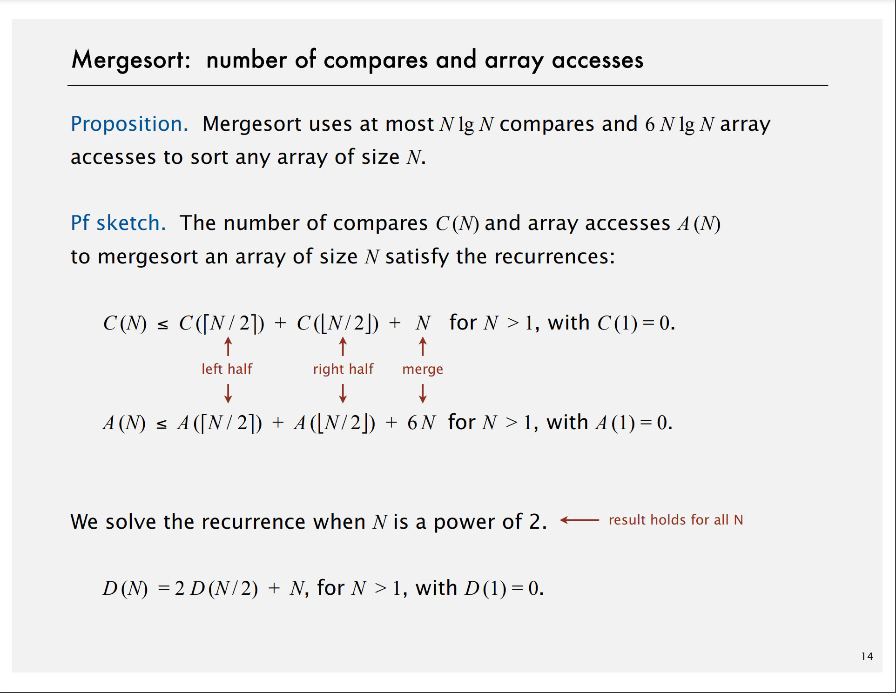

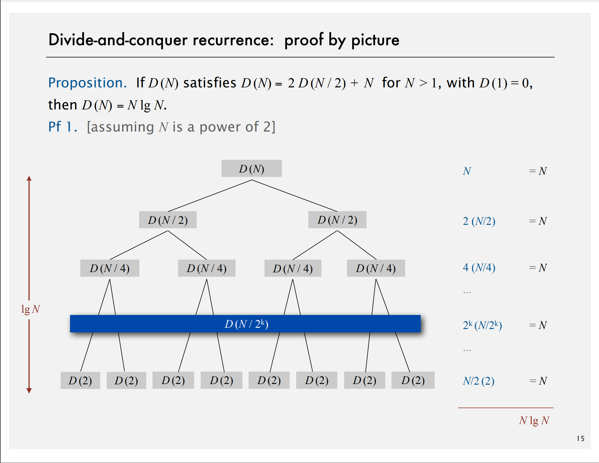

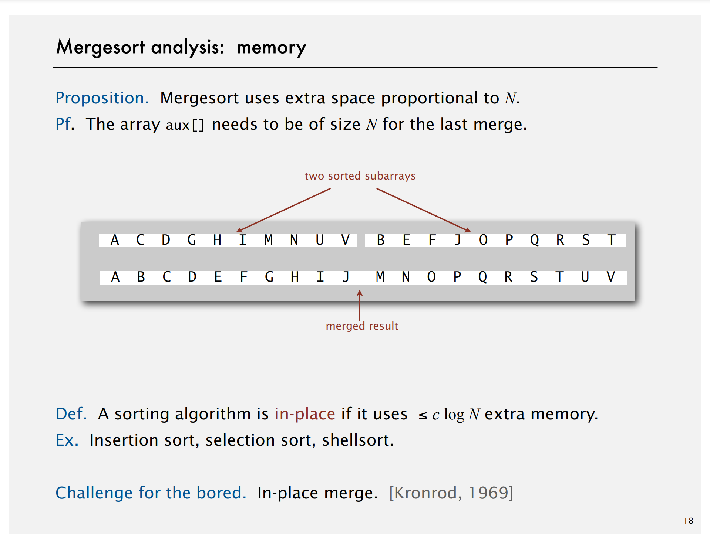

### Practical improvements

- **Use insertion for small subarrays (CUT_OFF = 7)**

  ```Java
  // if (hi <= lo) return;
  if (hi <= lo + CUT_OFF - 1) {
      Insertion.sort(a, lo, hi);
      return;
  }
  int mid = lo + (hi - lo) >> 2;
  sort(a, aux, lo, mid);
  sort(a, aux, mid+1, hi);
  merge(a, aux, lo, mid, hi);
  ```
- **Stop if already sorted**

  ```Java
  if (hi <= lo) return;
  int mid = lo + (hi - lo) >> 2;
  sort(a, aux, lo, mid);
  sort(a, aux, mid+1, hi);

  // Is biggest item in first half <= smallest item in second half? 
  if (!less(a[mid+1], a[mid])) return;
  merge(a, aux, lo, mid, hi);
  ```
- **Eliminate the copy to the auxiliary array**

  Save time (but not space) by switching the role of the input and auxiliary array in each recursive call.

  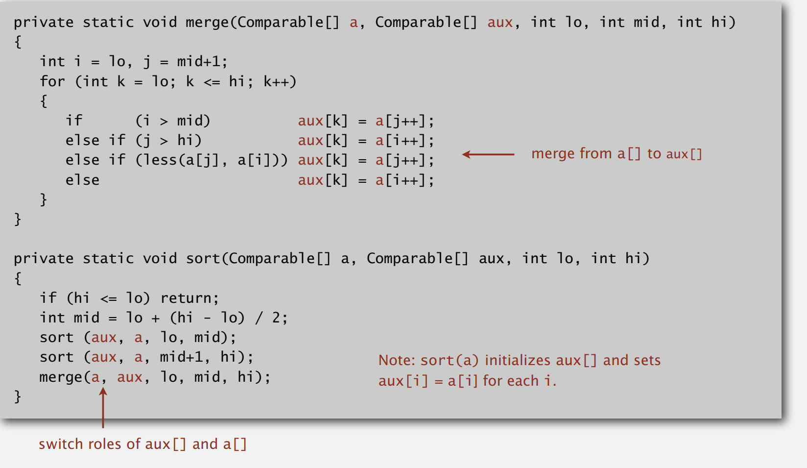

## Bottom-up mergesort

- Pass through array, merging subarrays of size 1.
- Repeat for subarrays of size 2, 4, 8, 16, ....

### Java implementation

```Java
public class BottomUpMerge {
    private static void merge(...)
    { /* as before */ }
  
    public static void sort(Comparable[] a)	// 10% slower than top-down
    {
        int N = a.length;
        Comparable[] aux = new Comparable[N];
        for (int sz = 1; sz < N; sz = sz + sz)
            for (int lo = 0; lo < N - sz; lo += sz+sz)
                merge(a, aux, lo, lo+sz-1, Math.min(lo+sz+sz-1, N-1));
    }
}
```

## Sorting complexity

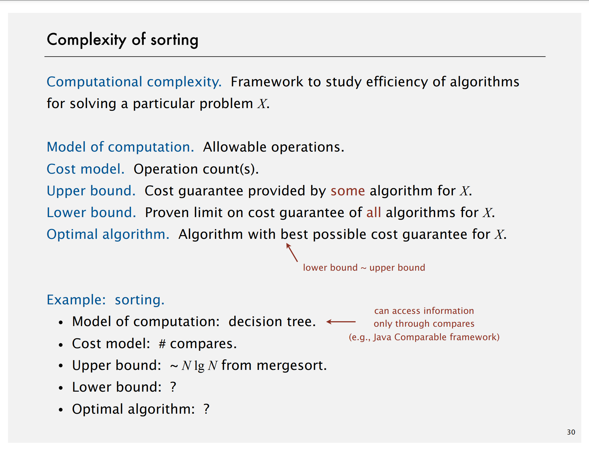

Decision tree: can access information only through compares (e.g. Java Comparable framework)

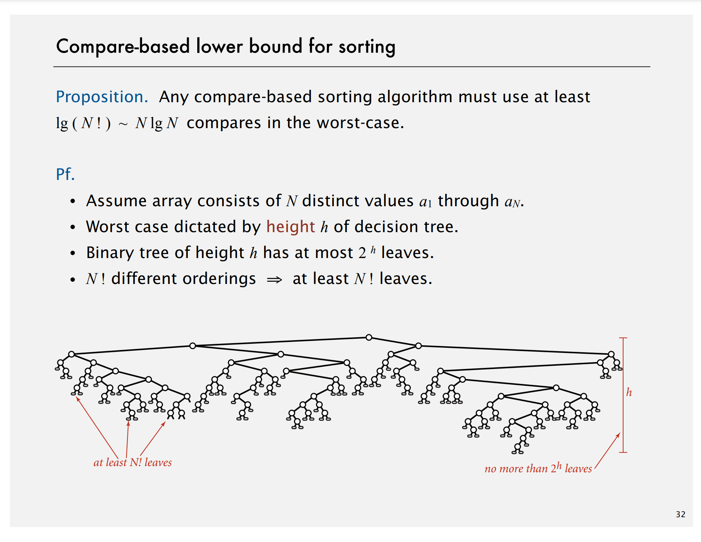

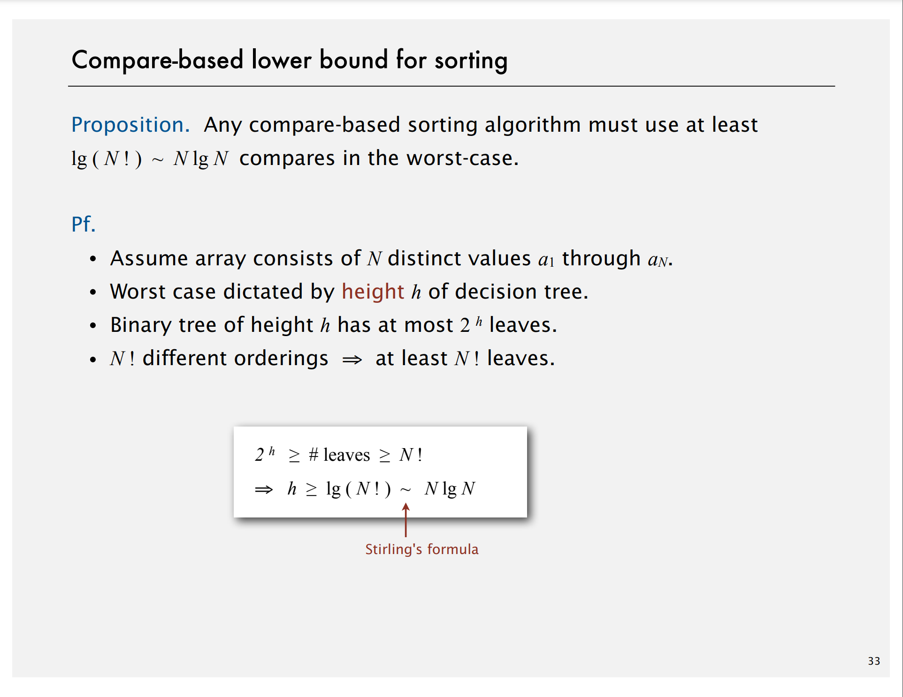

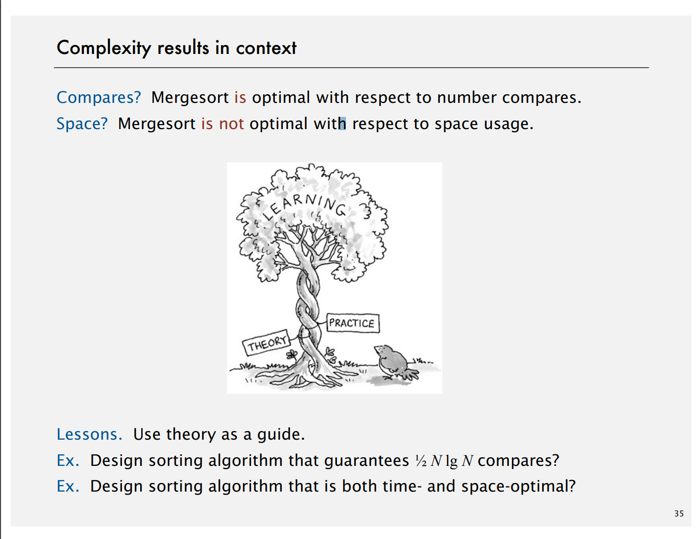

## Comparators

### Comparable interface

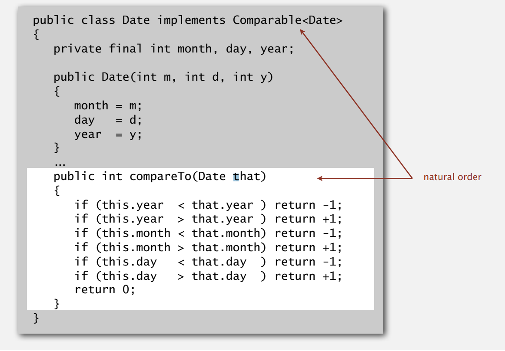

### Comparator interface

```Java
public interface Comparator<Key>
-----------------------------------------------------------------------
			int compare(Key v, Key w)
```

**Required property.** Must be a total order.

**System sort.**

- Create Comparator object.
- Pass second argument to ``Arrays.sort()``.


**Support comparators in sorting implementations.**

- Use ``Object`` instead of ``Comparable``.
- Pass ``Comparator`` to ``sort()`` and ``less()`` and use it in ``less()``

  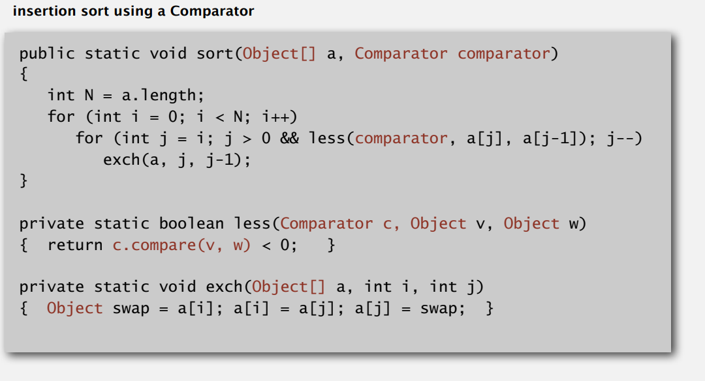

**To implement a comparator**

- Define a nested class that implements the ``Comparator`` interface.
- Implement the ``compare()`` method.

  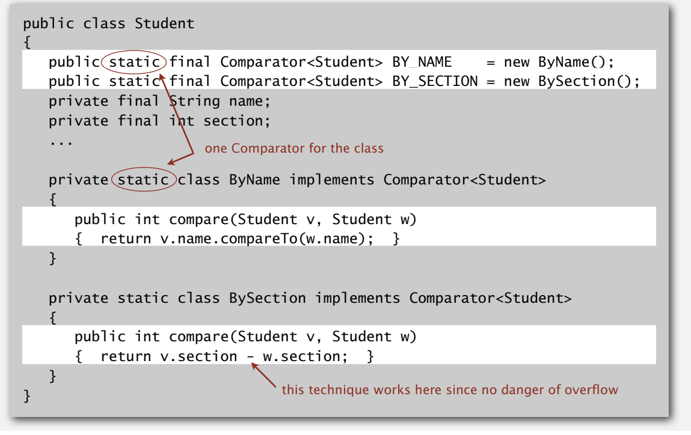

## Stability

A stable sort preserves the relative order of items with equal keys.

**Stable**: Insertion sort, merge sort

**Not stable**: Selection sort, shell sort

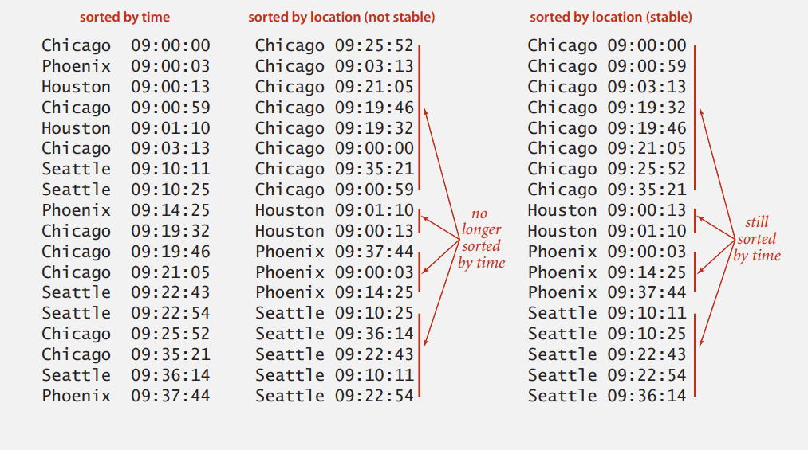
