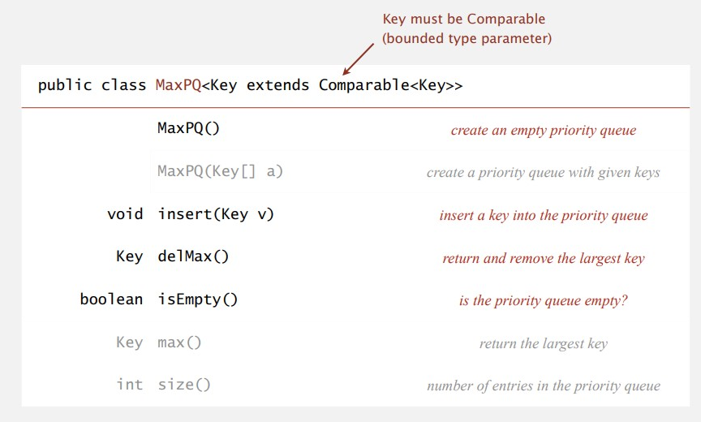
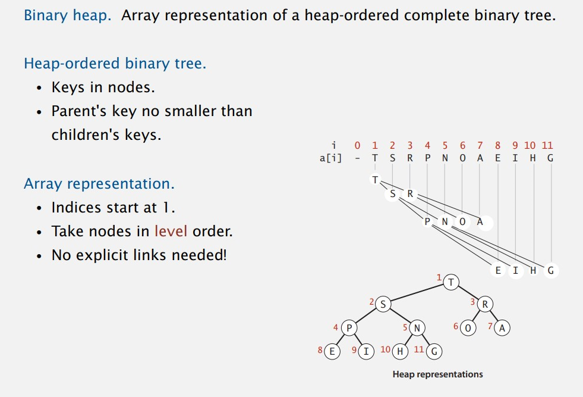
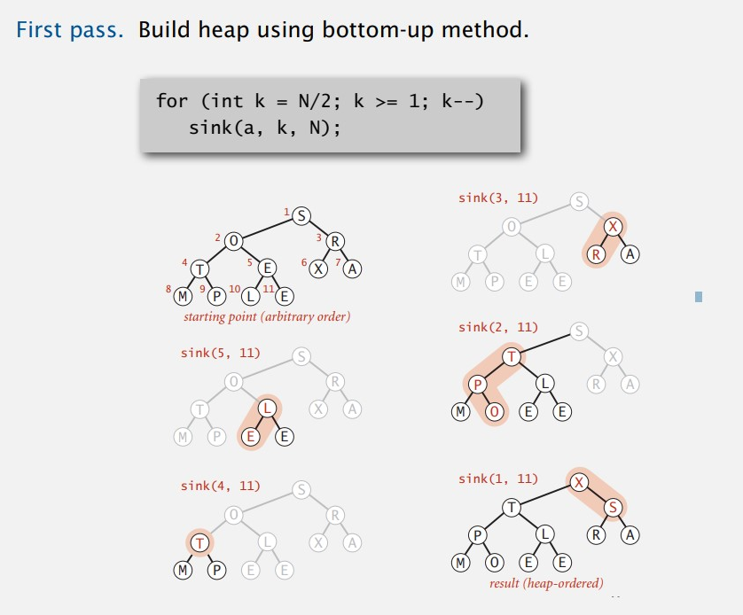
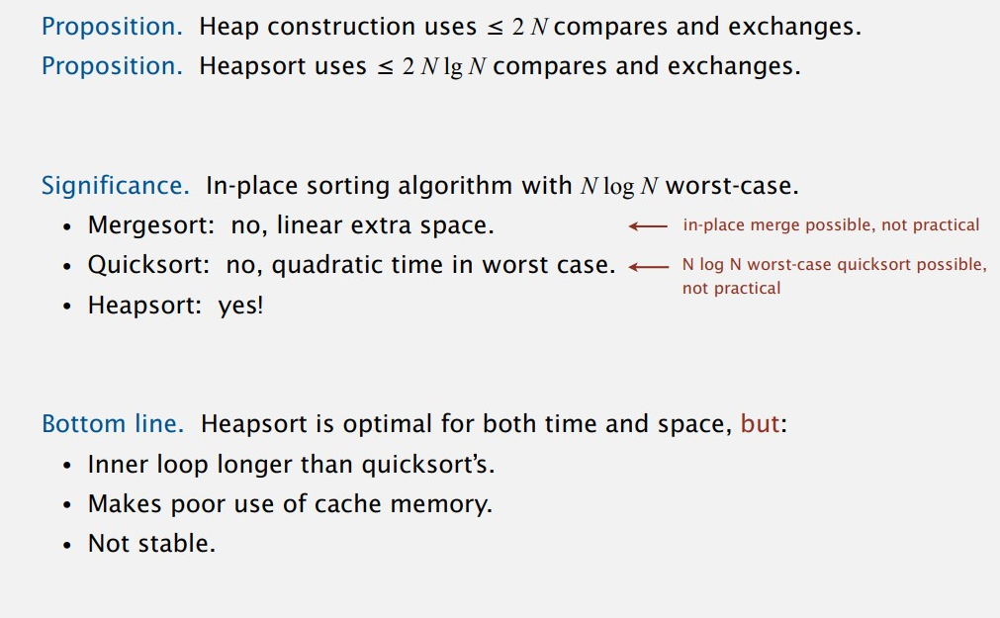
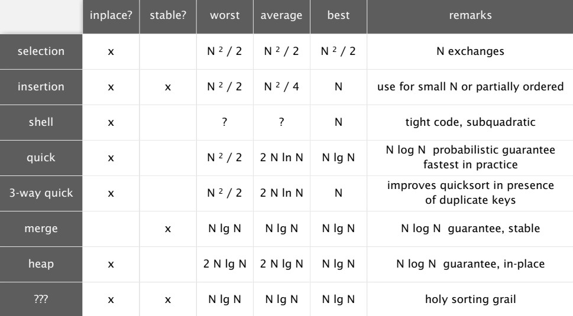

# Priority Queues

## API and elementary implementations

### API



### Priority queue: unordered array implementation

```java
public class UnorderedMaxPQ<Key extends Comparable<Key>>
{
    private Key[] pq;	// pq[i] = ith element on pq
    private int N;`		// number of elements on pq
  
    public UnorderedMaxPQ(int capacity){
    	pq = (Key[]) new Comparable[capacity];  // generic array creation
    }
  
    public boolean isEmpty() {
        return N == 0;
    }
  
    public void insert(Key x) {
        pq[N++] = x;
    }
  
    public Key delMax() {
        int max = 0;
        for (int i = 1; i < N; i++)
            if (less(max, i))	max = i;
        exch(max, N-1);
        return pq[--N];
    } 
}
```

## Binary heaps

### Complete binary tree

- Perfect balanced, except for bottom level binary tree.
- Height of complete binary tree with N nodes is `floor(lgN)`

### Binary heap representations



### Binary heap properties

- Largest key is a[1], root of tree
- Parent of node in k is at k/2
- Children of node at k is at 2k and 2k+1

### Binary heap operations

- Promotion

  ```Java
  private void swim(int k) {
      while (k > 1 && less(k/2, k)) {
          exch(k, k/2);
          k = k/2;
      }
  }
  ```
- Insertion

  ```Java
  public void insert(key x) {
      pq[++N] = x;
      swim(N);
  }
  ```
- Demotion

  ```java
  private void sink(int k) {
      while (2 * k <= N) {
          int j = 2 * k;
          if (j < N && less(j, j+1)) j++;	// node at 2k and 2k+1
          if (!less(k, j)) break;
          exch(k, j);
          k = j;
      }
  }
  ```
- Delete max

  ```java
  public Key delMax() {
      Key max = pq[1];
      exch(1, N--);
      sink(1);
      pq[N+1] = null;
      return max;
  }
  ```

### Binary heap: Java implementation

```java
public class MaxPQ<Key extends Comparable<Key>>
{
    private Key[] pq;
    private int N;
  
    public MaxPQ(int capacity) {
        pq = (Key[]) new Comparable[capacity+1];
    }
  
    public boolean isEmpty() {
        return N == 0;
    }
  
    public void insert(Key key) {}
  
    public Key delMax() {}
  
    private void swim(int k) {}
  
    private void sink(int k) {}
  
    private boolean less(int i, int j) {
        return pq[i].compareTo(pq[j]) < 0;
    }
  
    private void exch(int i, int j) {
        Key t = pq[i];
        pq[i] = pq[j];
        pq[j] = t;
    }
}
```

### Costs comparison


## Heapsort

1. Heap construction: build max heap using bottom-up method
2. Sort down: repeatedly delete the largest remaining item




### Heapsort: java implementation

```java
public class Heap
{
    public static void sort(Comparable[] a) {
        int N = a.length;
        for (int k = N/2; k >= 1; k--)
            sink(a, k, N);
        while (N > 1) {
            exch(a, 1, N);
            sink(a, 1, --N);
        }
    }
}
```

### Mathematical analysis



### Summary all sorting


