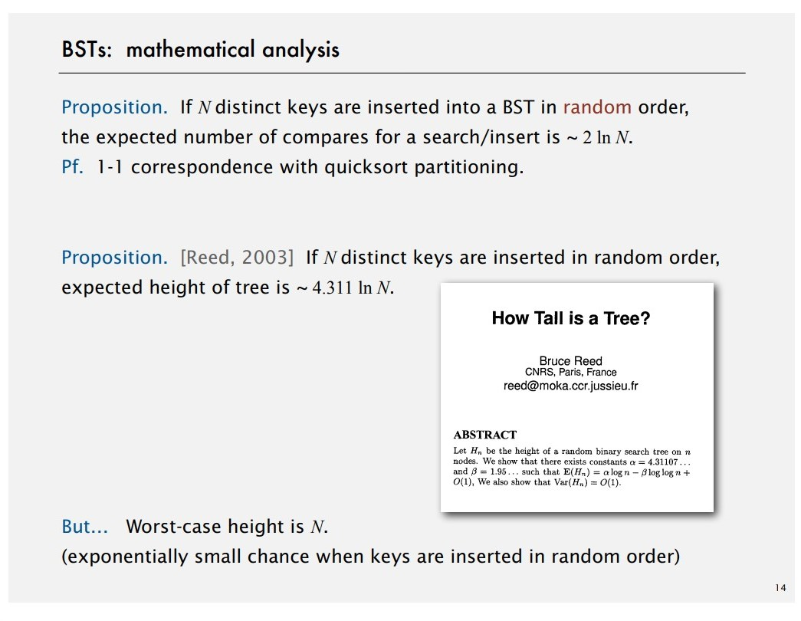
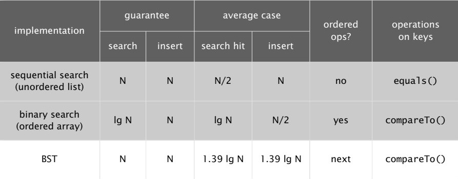
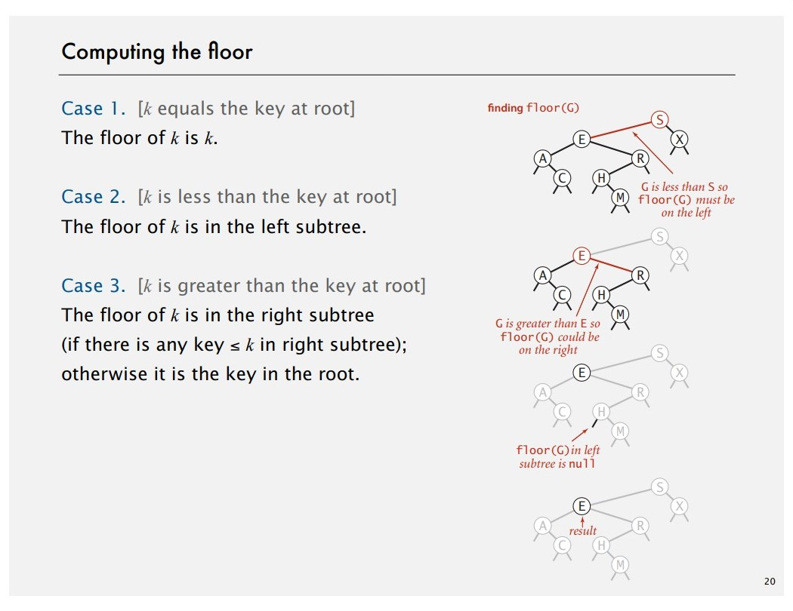
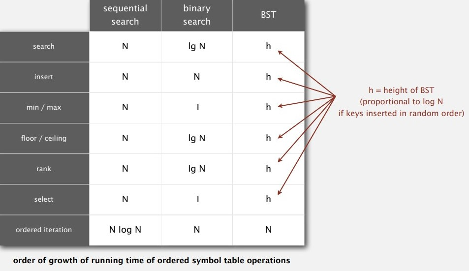
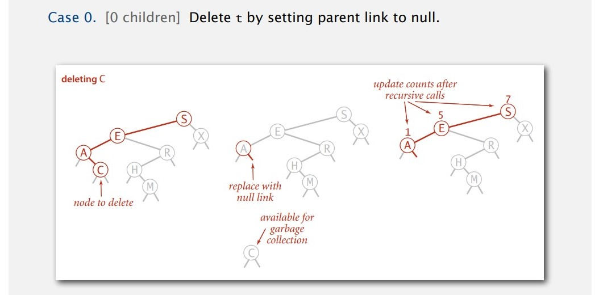
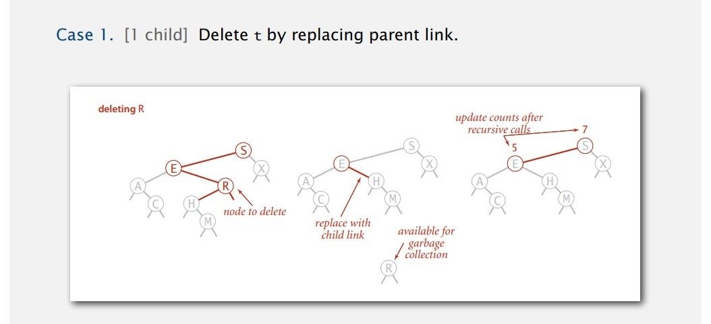
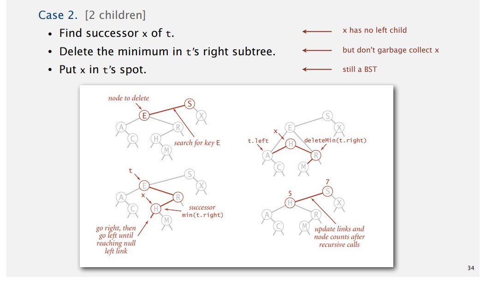
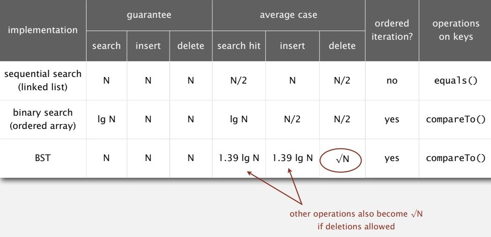

# Binary Search Tree

## BSTs

**Definition.** A BST is a binary tree in symmetric order. (Binary tree inorder traversal)

**Symmetric order.** Each node has a key and every node's key is:

* Larger than all keys in its left subtrees
* Smaller than all keys in its right subtrees

**Java implementations.**

- Node

  ```java
  private class Node {
  	private Key key;
  	private Value val;
  	private Node left, right;
  }
  ```
- APIs

  ```java
  public class BST<Key extends Comparable<Key>, Value> {
  	private Node root;

  	public class Node {}
  	public void put(Key key,  Value val) {}
  	public Value get(Key key) {}
  	public void delete(key key) {}
  	public Iterable<Key> iterator() {}
  }
  ```
- BST search

  - **Search.** If less, go left; if greater, go right; if equal, search hit.
  - **Get.** Return value corresponding to given key, or null if no such key.
  - **Cost.** Number of compares is equal to 1 + depth of node.

  ```java
  public Value get(Key key) {
  	Node x = root;
  	whle (x != null) {
  		int cmp = key.compareTo(x.key);
  		if (cmp > 0) x = x.right;
  		else if (cmp < 0) x = x.left;
  		else return x.val;
  	}
  	return null;
  }
  ```
- BST insert (#compares = 1 + depth of node)

  - **Insert.** If less, go left; if greater, go right; if null, insert.
  - **Put.** Associate value with key.
  - Search for key, then two cases:
    ・Key in tree ⇒ reset value.
    ・Key not in tree ⇒ add new node.
  - **Cost.** Number of compares is equal to 1 + depth of node.

  ```java
  public void put(Key key, Value val) {
  	root = put(root, key, val);
  }

  private Node put(Node x, key key, Value val) {
  	if (x == null) return new Node(key, val);
  	int cmp = key.compareTo(x.key);
  	if (cmp < 0)	  x.left = put(x.left, key, val);
  	else if (cmp > 0) x.right = put(x.right, key, val);
  	else 	   	  x.val = val;
  	return x;
  }
  ```

**Mathematical analysis.**





## Ordered operations

### Floor

**Floor.** Largest key ≤ a given key.
**Ceiling.** Smallest key ≥ a given key.



```java
public Key floor(Key key) {
	Node x = floor(root, key);
	if (x == null) return null;
	return x.key;
}

private Node floor(Node x, Key key) {
	if (x == null) return null;
	int cmp = key.compareTo(x.key);

	if (cmp == 0) return x;
	if (cmp < 0) return floor(x.left, key);
	Node t = floor(x.right, key);
	if (t != null) return t;
	else return x;
}
```

### Subtree count

```java
public int size() { return size(root); }

private int size(Node x) {
	if (x == null) return 0;
	return x.count;
}
```

Respectively, we need make changes on:

```java
private class Node {
	private Key key;
	private Value val;
	private Node left;
	private Node right;
	private int count; // numbers of nodes in subtree
}
```

```java
private Node put(Node x, key key, Value val) {
	if (x == null) return new Node(key, val, 1);
	in cmp = key.compareTo(x.key);
	if (cmp < 0) x.left = put(x.left, key, val);
	else if (cmp > 0) x.right = put(x,right, key, val);
	else x.val = val;
	x.count = 1 + size(x.left) + size(x.right); // subtree count update
	return x;
}
```

### Rank

**Rank.** How many keys < *k*.

```java
public int rank(key key) { return rank(key, root); }

private int rank(key key, Node x) {
	if (x == null) return 0;
	int cmp = key.compareTo(x.key);
	if (cmp < 0)      return rank(key, x.left);
	else if (cmp > 0) return 1 + size(x.left) + rank(key, x.right);
	else 		  return size(x.left);
}
```

### Inorder traversal

**Property.** Inorder traversal of a BST yields keys in ascending order.

```java
public Iterable<Key> keys() {
	Queue<Key> q = new Queue<Key>();
	inorder(root, q);
	return q;
}

private void inorder(Node x, Queue<Key> q) {
	if (x == null) return;
	inorder(x.left, q);
	q.enqueue(x.key);
	inorder(x.right, q);
}
```

### Cost summary



## Deletion

### Delete the minimum

- Go left until finding a node with a null left link.
- Replace that node by its right link.
- Update substree counts.

```java
public void deleteMin() { root = deleteMin(root); }

private Node deleteMin(Node x) {
	if (x.left == null) return x.right;
	x.left = deleteMin(x.left);
	x.count = 1 + size(x.left) + size(x.right);
	return x;
}
```

### Hibbard deletion

- To delete a node with key *k:* search for node *t* containing key *k.*



- Java implementation

  ```java
  public void delete() { root = delete(root, key); }

  private Node delete(Node x, key key) {
  	if (x == null) return null;
  	int cmp = key.compareTo(x.key);
  	if (cmp < 0) x.left = delete(x.left, key); // search for key
  	else if (cmp > 0) x.right = delete(x.right, key);
  	else {
  		if (x.right == null) return x.left; // no right child
  		else if (x.left == null) return x.right; // no left child
  		else {
  			Node t = x;
  			x = min(t.right);	// replace with successor
  			x.right = deleteMin(t.right);
  			X.left = t.left;
  		}
  	}
  	x.count = size(x.left) + size(x.right) + 1; // update substree counts
  	return x;
  }
  ```
- Non-symmetric

  
