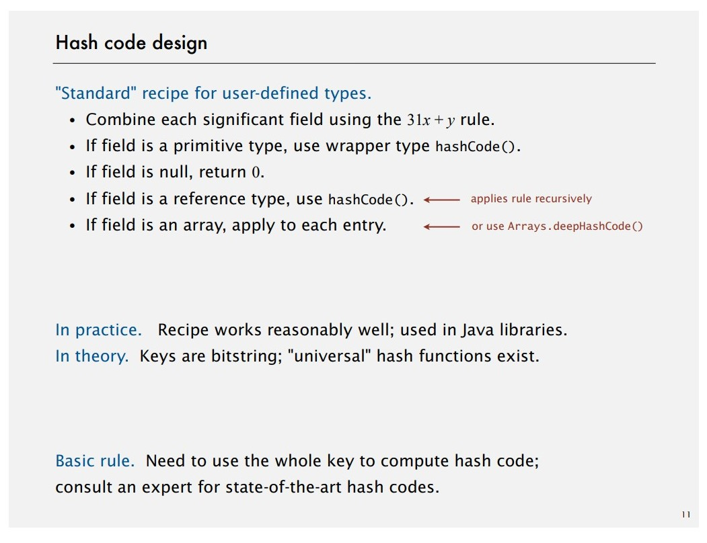
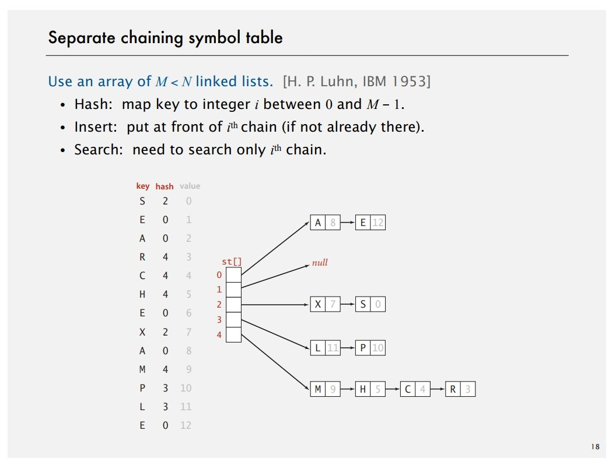
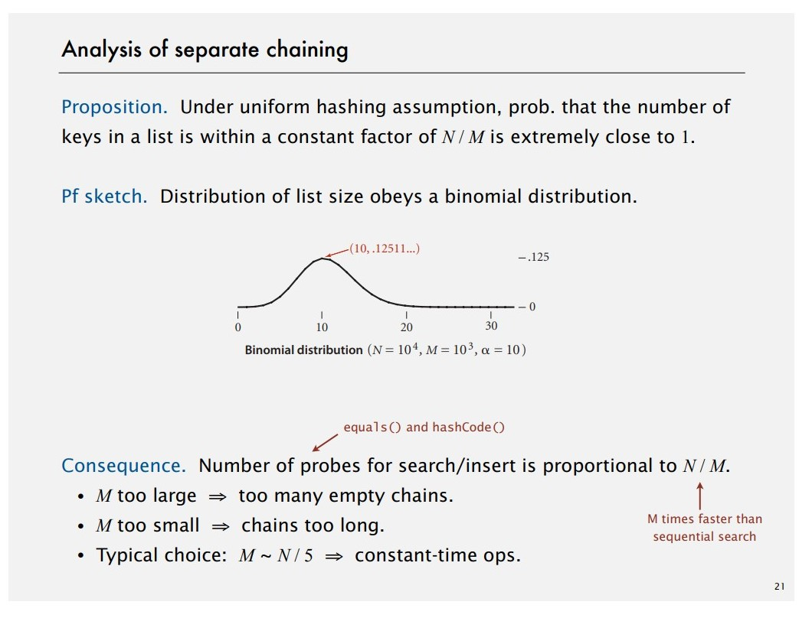
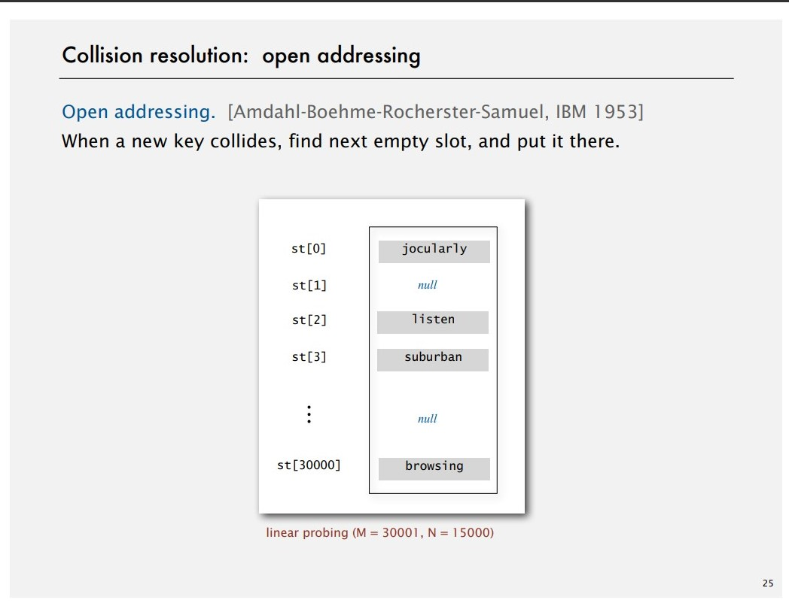
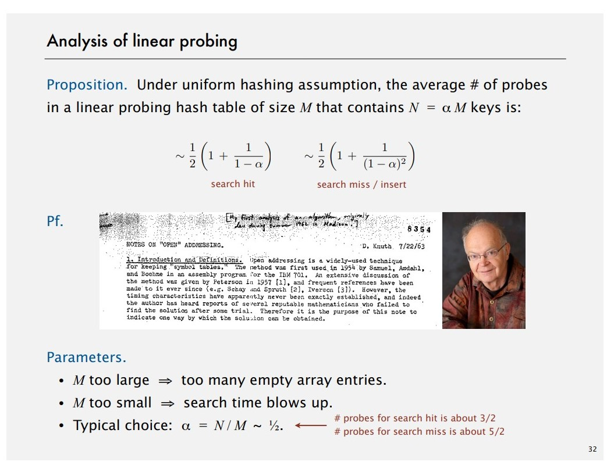
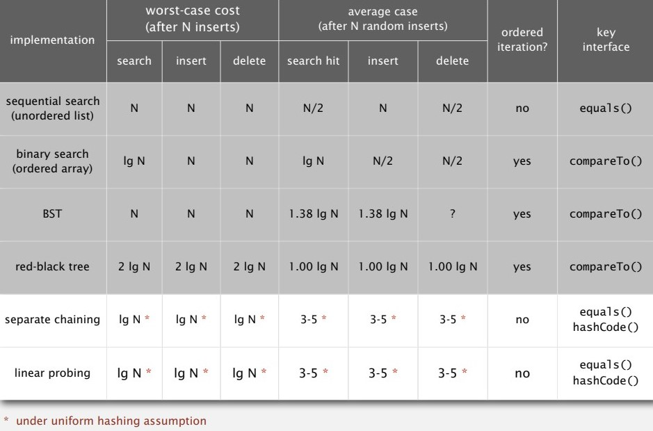
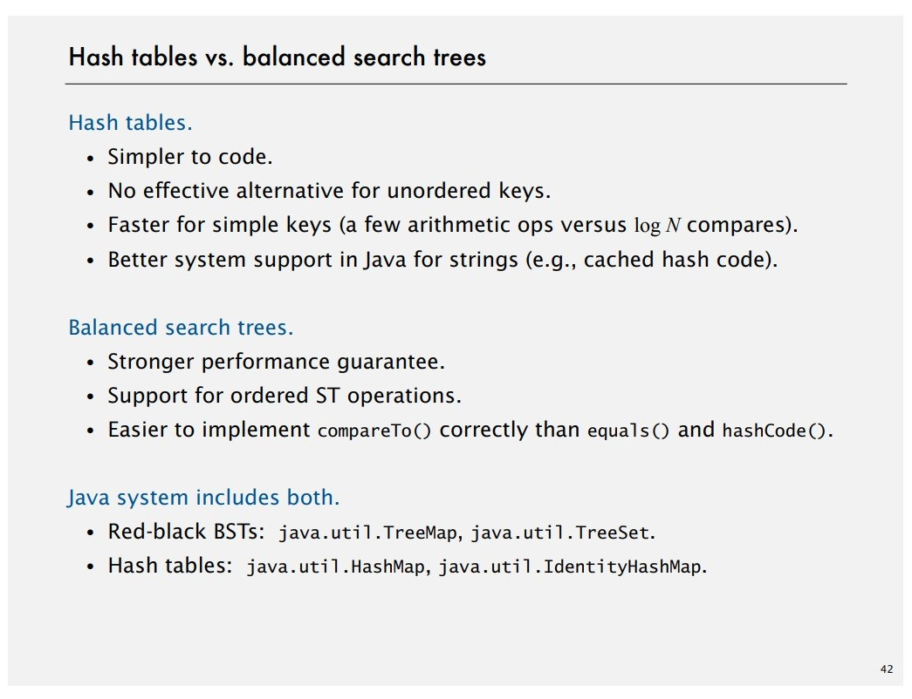

# Hash Tables

**Hashing.** Save items in a key-indexed table by hash functions.

**What we consider?** Space-time tradeoff, hash functions, equality test, collision resolution etc.

## Hash functions

### Java hash code conventions


### Java implementations

- Integer

  ```java
  public final class Integer {
  	private final int value;
  	public int hashCode() { return value; }
  }
  ```
- Boolean

  ```java
  public final class Boolean {
  	private final boolean value;
  	public int hashCode() {
  		if (value) return 1231;
  		else return 1237;
  	}
  }
  ```
- Double

  ```java
  public final class Double {
  	private final double value;
  	public int hashCode() {
  		long bits = doubleToLongBits(value); // convert to IEEE 64 bits representation
  		return (int)(bits ^ (bits >>> 32)); // xor most significant 32-bits with least 32-bits
  	}
  }
  ```
- String

  - Horner's method to hash string of length L: L multiplies/adds.
  - Equivalent to h = s[0] · $31^{L-1}$ + … + s[L – 3] · $31^2$ + s[L – 2] · $31^1$ + s[L – 1] · $31^0$.

  ```java
  public final class String {
  	private final char[] s;
  	private int hash = 0; // cache for hash code
  	public int hashCode() {
  		int h = hash; // return cached value
  		if (h != 0) return h;
  		for (int i = 0; i < length(); i++)
  			h = s[i] + (31 * hash);
  		hash = h;	// store cache of hash code
  		return h;
  	}
  }
  ```
- User-defined types

  ```java
  public final class Transaction implements Comparable<Transaction> {
  	private final String who;
  	private final Date when;
  	private final double amount;

  	public int hashCode() {
  		int hash = 17;	// nonzero constant
  		hash = 31*hash + who.hashCode(); 
  		hash = 31*hash + when.hashCode(); // for reference types, use hashCode()
  		hash = 31*hash + ((Double) amount).hashCode(); // for primitive types, use hashCode() of wrapper type
  		return hash;
  	}
  }
  ```

### Hash code design



### Modular hashing


### Uniform hashing assumption

**Refer to slides.**

## Separate chaining



### Separate chaining ST: Java implementation

```java

public class SeparateChainHashST<Key, Value> {
	private int M = 97;	// number of chains
	private Node[] st = new Node[M]; // array of chains

	private static class Node {
		private Object key; // no generic array creation
		private Object val; // thus declare key and value of Object
		private Node next;
	}

	private int hash(Key key) 
	{ return (key.hashCode() & 0x7fffffff) % M; } // solve negative keys

	public Value get(Key key) {
		int i = hash(key);
		for (Node x = st[i]; x != null; x= x.next)
			if (key.equals(x.key)) return (Value)x.val;
		return null;
	} 

	public void put(key key, Value val) {
		int i = hash(key);
		for (Node x = st[i]; x != null; x = x.next)
			if (key.equals(x.key)) { x.val = val; return; }
		st[i] = new Node(key, val, sty[i]);
	}
}
```

### Analysis of separate chaining



## Linear probing



### Linear probing ST: Java implementation

```java
public class LinearProbingHashST<Key, Value> {
	private int M = 30001;
	private Value[] vals = (Value[]) new Object[M];
	private Key[] keys = (Key[]) new Object[M];

	private int hash(key key) { /* as before */}

	public void put(Key key, Value val) {
		int i;
		for (i = hash(key); keys[i] != null; i = (i+1) % M)
			if (keys[i].equals(key)) break;
		keys[i] = key;
		vals[i] = val;
	}

	public Value get(Key key) {
		for (int i = hash(key); keys[i] != null; i =(i+1) % M)
			if (key.equals(keys[i])) break;
		return null;
	}
}
```

### Clustering, Knuth's parking problem

***Refer to slides***

### Analysis of linear probing



### Cost summary

![1641743612048.png]

## Context

**Algorithmic complexity attackshash.** Pass the hash attack.

**One-way hash functions.** MD4, MD5, SHA-0, SHA-1 (known to be secure) and etc.

**Hashing variations on theme.** Two-probe hashing, Double hashing, Cuckoo hashing.

**Hash tables vs. balanced search trees.**


