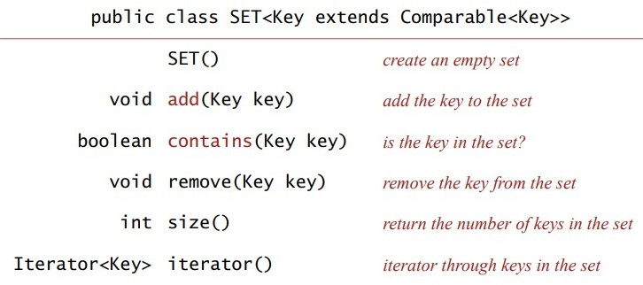
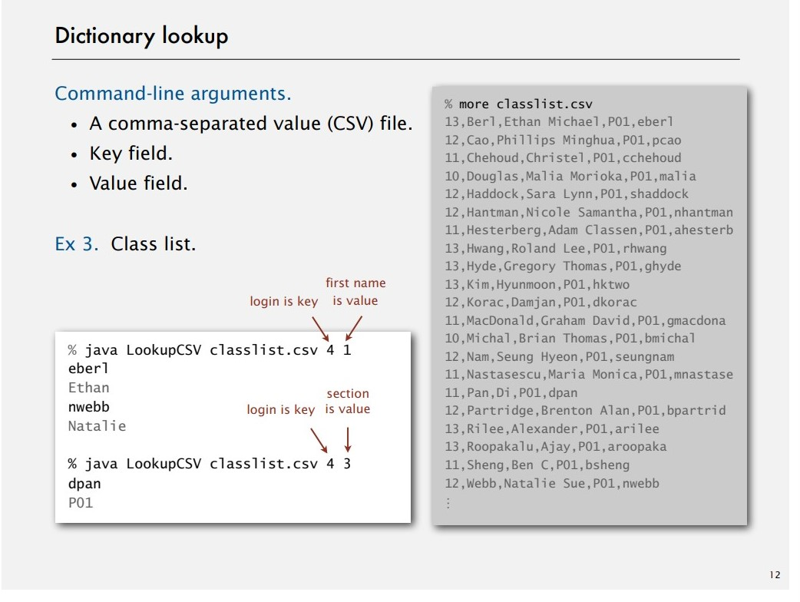
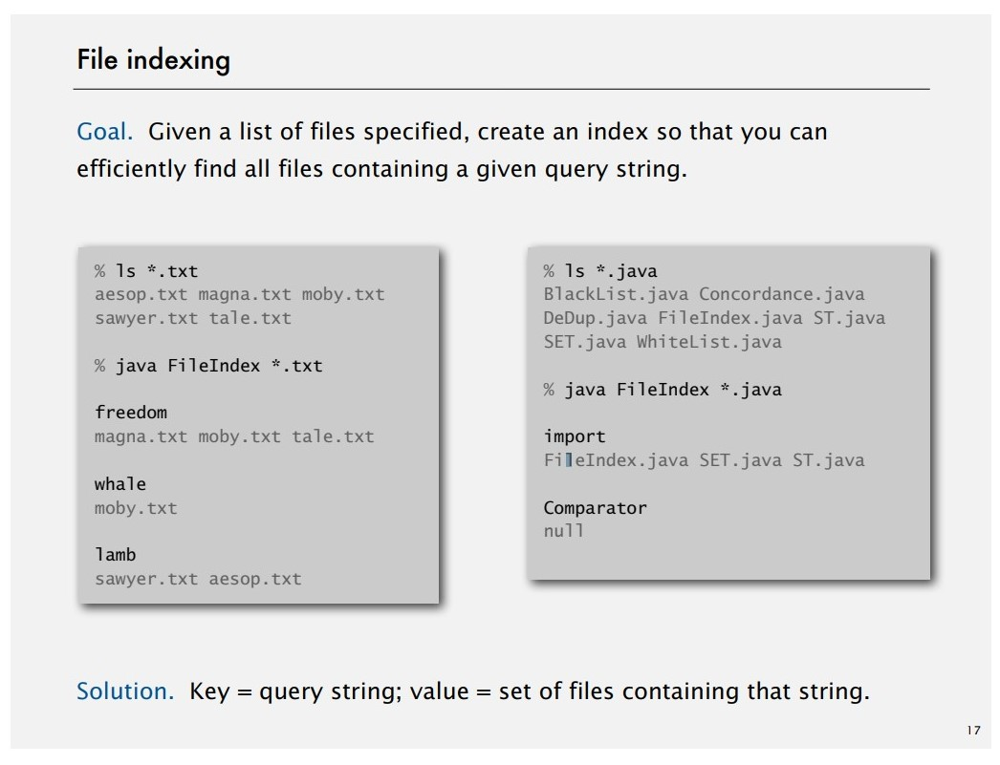
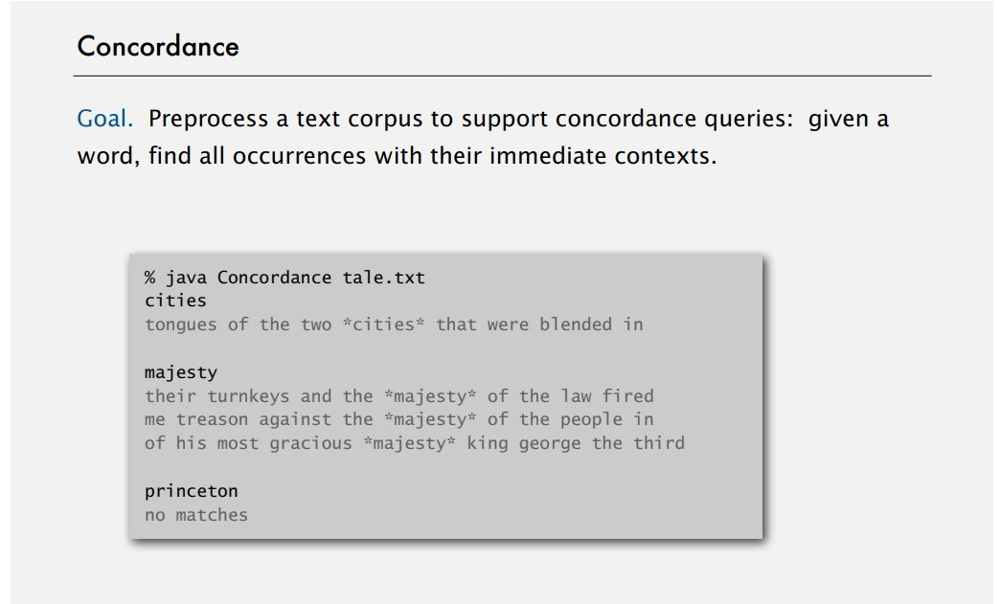
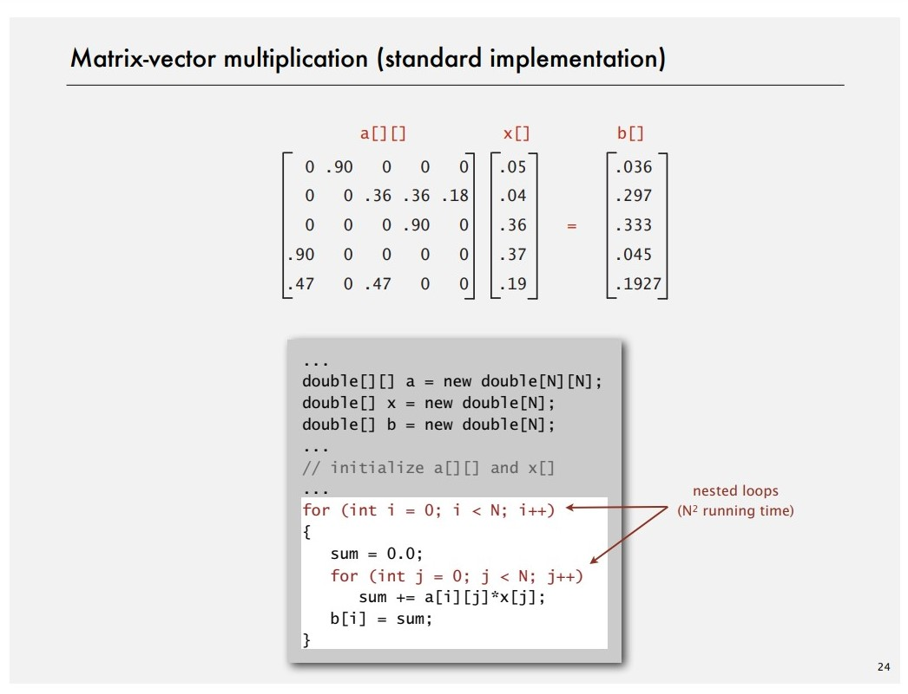
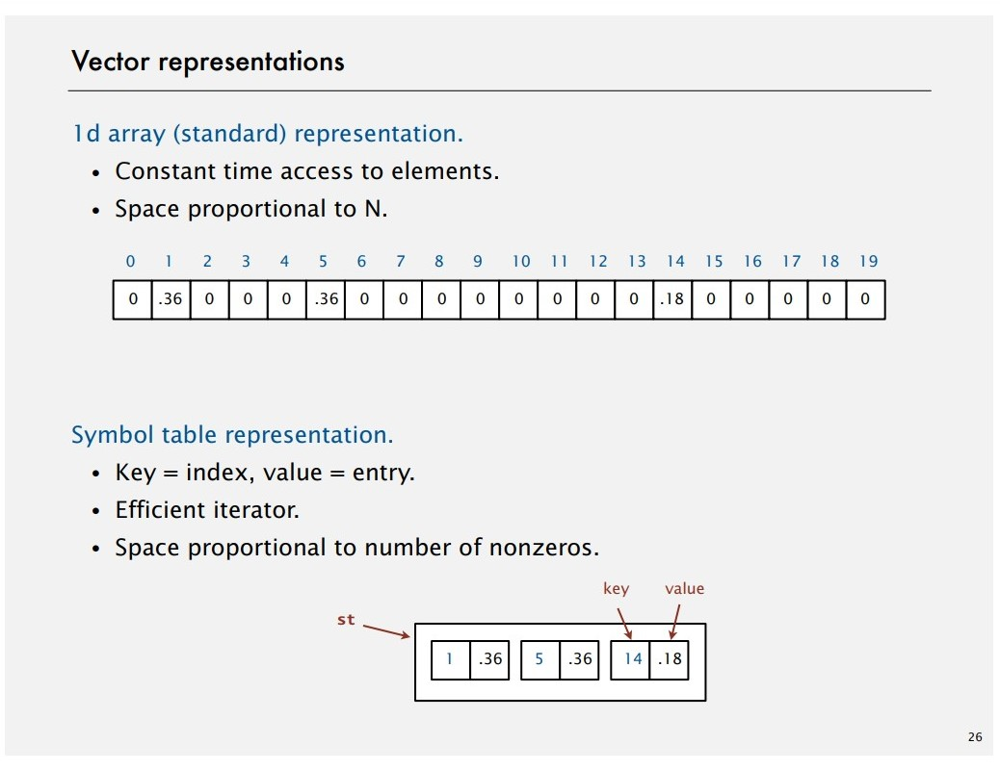
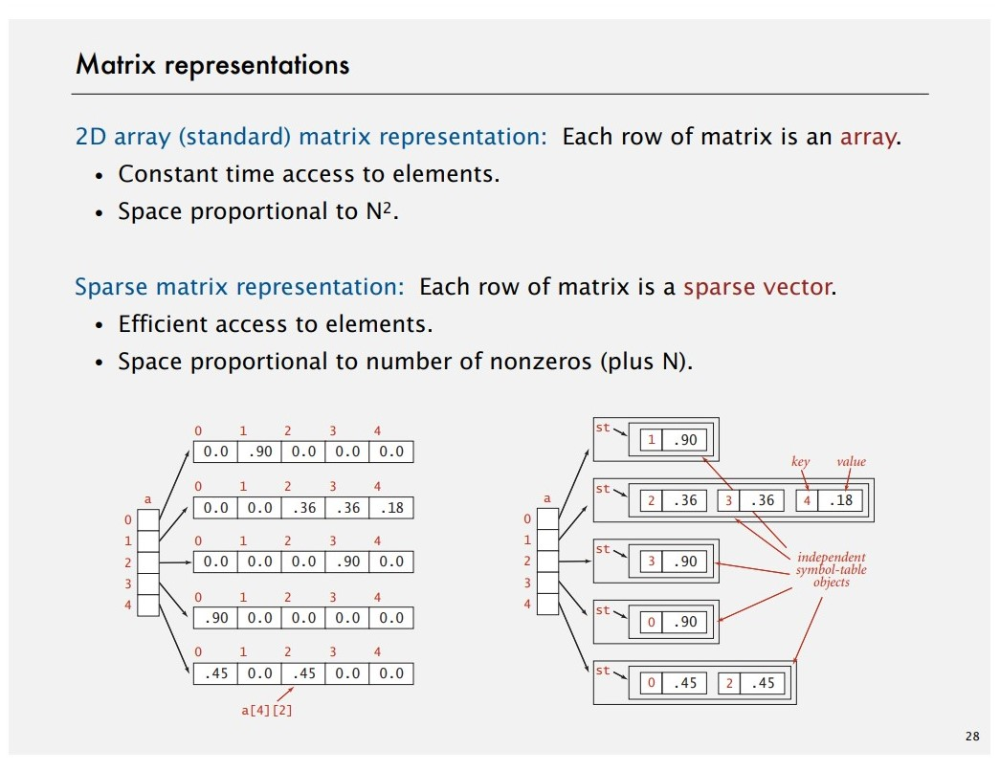
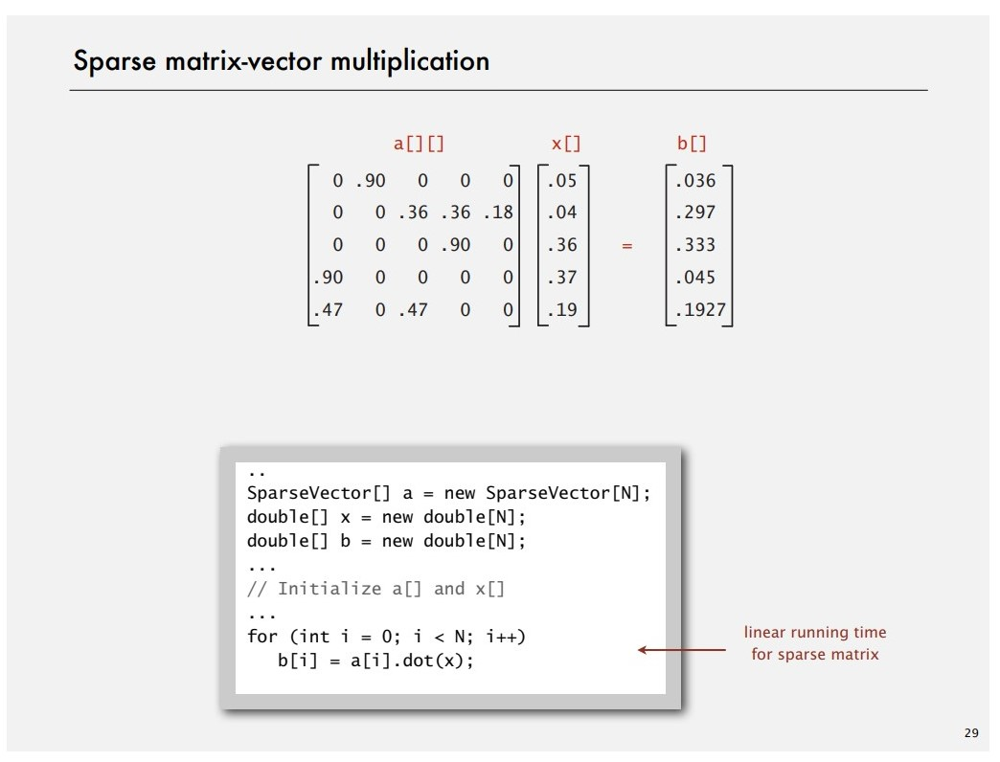

# Symbol Table Applications

## Sets

### Set API

**Mathematical set.** A collection of distinct keys.



### Exception filter

- Read a list of words from one file.
- Print out all words from standard input that are {in, not in} the list.
- WhiteList & BlackList

**Java implementation**

```java
public class WhiteList {
	public static void main(String[] args) {
		SET<String> set = new SET<String>(); // create empty set of strings
		In in = new In(args[0]);
		while (!in.isEmpty())		// read in whitelist
			set.add(in.readString());
		while (!StdIn.isEmpty()) {
			String word = StdIn.readString();
			if (set.contains(word))	// printout words not in list
				StdOut.println(word);
		}
	}
}
```

## Dictionary clients



**Java implementation.**

```java
public class LookUpCSV {
	public static void main(String[] args) {
		// process input files
		In in = new In(args[0]);
		int keyField = Integer.parseInt(args[1]);
		int valueField = Integer.parseInt(args[2]);

		// build symbol table
		ST<String, String> st = new ST<String, String>();
		while (!in.isEmpty()) {
			String line = in.readLine();
			String[] tokens = line.split(",");
			String key = tokens[keyField];
			String val = tokens[vlaField];
			st.put(key, val);
 		}

		// process lookups with standard I/O
		while (!StdIn.isEmpty()) {
			String s = StdIn.readString();
			if (!st.contains(s)) StdOut.println("Not found");
			else StdOut.println(st.get(s));
		}
	}
}
```

## Indexing clients

### File indexing



**Java implementation.**

```java
import java.io.File;
public class FileIndex {
	public static void main(String[] args) {
		// remind of choice of symbol tabkle key-value pairs
		ST<String, SET<File>> st = new ST<String, SET<File>>();

		// list of file names from command line 
		for (String filename : args) {
			File file = new File(filename);
			In in = new In(file);

			// for each word in file, add file to corresponding set
			while (!in.isEmpty()) {
				String key = in,.readString();
				if (!st.contains(key))
					st.put(key, new SET<File>());
				SET<File> set = st.get(key);
				set.add(file);
			}
		}

		// process queries
		while (!StdIn,isEmpty()) {
			String query = StdIn.readString();
			StdOut.println(st.get(query));
		}
	}
}
```

### Concordance



**Java implementation.**

```java
public class Concordance {
	public static void main(String[] args) {
		// read text and  build index
		In in = new In(args[0]);
		String[] words = in.readAllStrings();
		ST<String, SET<Integer>> st = new ST<String, SET<Integer>>();
		for (int i = 0; i < words.length; i++) {
			String s = words[i];
			if (!st.contains(s))
				st.put(s, new SET<Integer>());
			SET<Integer> set = st.get(s);
			set.add(i);
		}

		// process queries and print concordance
		while (!StdIn.isEmpty()) {
			String query = StdIn.readString();
			SET<Integer> set = st.get(query);
			for (int k : set) // print words[k-4] to words[k+4]
		}
	}
}
```

## Sparse vectors

**Sparse vector.** A vector that has a large number of zeros so it takes unwanted space to store these zeroes.



### Vector representations



**Sparse vector data type.**

```java
public class SparseVector {
	// HashST because order not important
	private HashST<Integer, Double> v;

	// empty ST represents all 0s vector
	public SparseVector() {	v = new HashST<Integer, Double>(); }

	public void put(int i, double x) { v.put(i, x); } // a[i] = value

	public double get(int i) {	// return a[i]
		if (!v.contains(i)) return 0.0;
		else return v.get(i);
	}

	public Iterable<Integer> indices() { return v.keys(); }

	// dot product is constant time for sparse vectors
	public double dot(double[] that) {
		double sum = 0.0;
		for (int i : indices())
			sum += that[i] * this.get(i);
		return sum;
	}
	 
}
```


### Matrix representations




