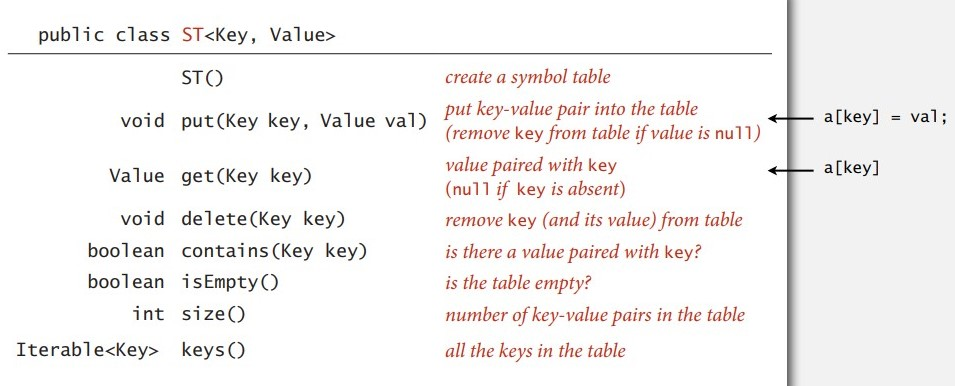
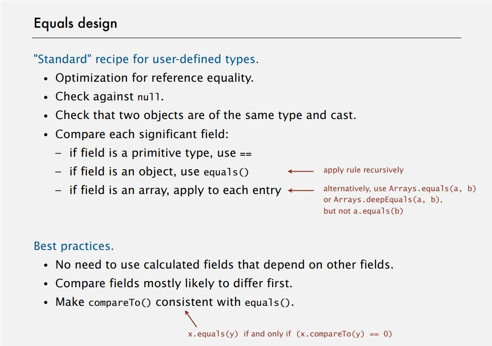
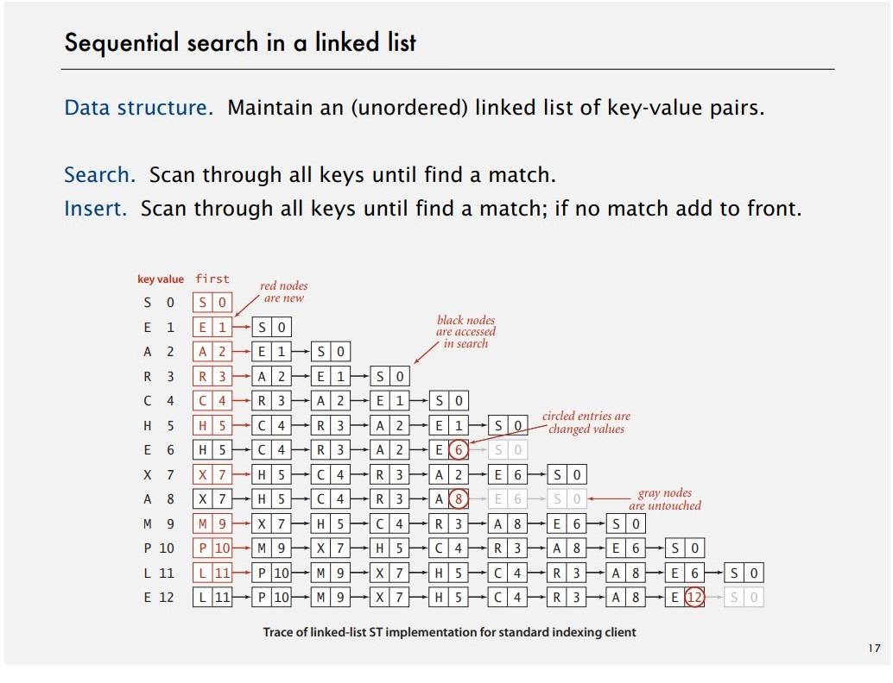
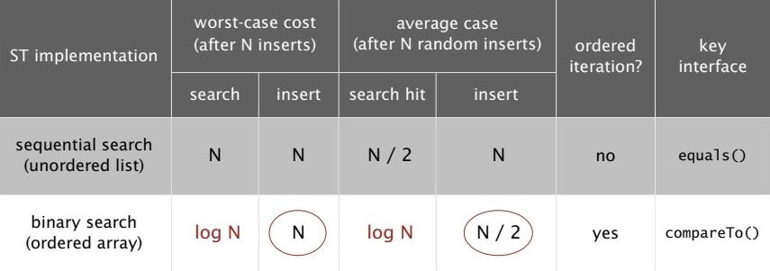
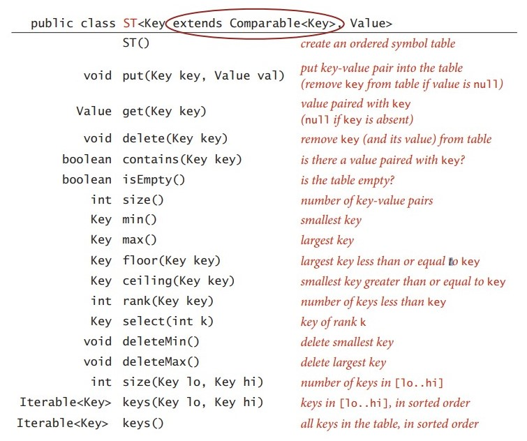

# Symbol Tables

Key-value pair abstraction.

- Insert a *value* with specified *key*.
- Given a *key*, search for the corresponding *value*.

## API   {1}



### Conventions

- Value not `null`.
- Method `get()` return `null` if key not exists.
- Method `put()` overwrites.

```java
 public boolean contains(Key key) { return get(key) != null; }
```

```java
public void delete(key key) { put(key, null); }
```

### Keys and values

- Key types: `Comparable` -> `compareTo()`, generic types -> `equals()`
- Use immutable types (`Integer`, `Double`, `String`, `java.io.File` and etc.) as keys

### Equality test and design

- What is the difference bewteen `==` and `equals()` in Java? [See link.](https://stackoverflow.com/questions/7520432/what-is-the-difference-between-and-equals-in-java "See link")
- Example in final class `Date` implements `Comparable<Date>`

  ```java
  public boolean equals(Object y) 
  {
      if (y == this) return true;
      if (y == null) return false;
      if (y.getClass() != this.getClass())
  	return false;
      Date that = (Date) y;
      if (this.day != that.day) return false;
      if (this.month != that.month) return false;
      if (this.year != that.year) return false;
      return true;
  }
  ```

  

## Elementary implementations

### Sequential search in linked list  



### Binary search in ordered array

```java
public Value get(Key key)
{
    if (isEmpty()) return null;
    int i = rank(key);
    if (i < N && keys[i].compareTo(key) == 0) return vals[i];
    else return null;
}

private int rank (Key key)
{
    int lo = 0, hi = N - 1;
    while (lo <= hi)
    {
	int mid = lo + (hi - lo) / 2;
	int cmp = key.compareTo(keys[mid]);
	if (cmp > 0) lo = mid + 1;
	if (cmp < 0) hi = mid - 1;
	else return mid;
    }
    return lo;
}
```

### Cost summary



## Ordered operations


