# Union Find

## Dynamic connectivity

**Operations.** Given a set of N objects

- Union: connect two object
- Find/connected query: is there a a path connecting the two objects?

**Union-find data type**

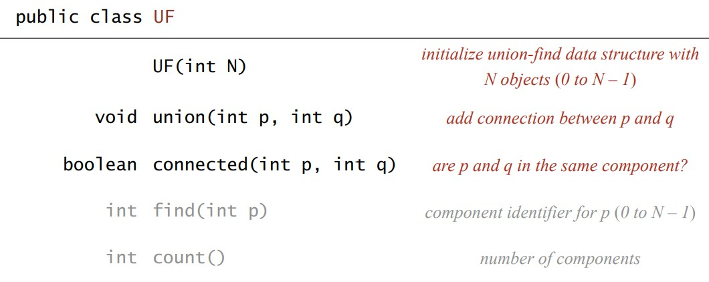

**Dynamica-connectivity client**

```java
public static void main(String[] args)
{
	int N = StdIn.readInt();
	UF uf = new UF(N);
	while (!StdIn.isEmpty()) {
		int p = StdIn.readInt();
		int q = StdIn.readInt();
		if (!uf.connected(p, q)) {
			uf.union(p, q);
			StdOut.println(p + " " + q);
		}
	}
} 
```

## Quick find

**A eager approach**

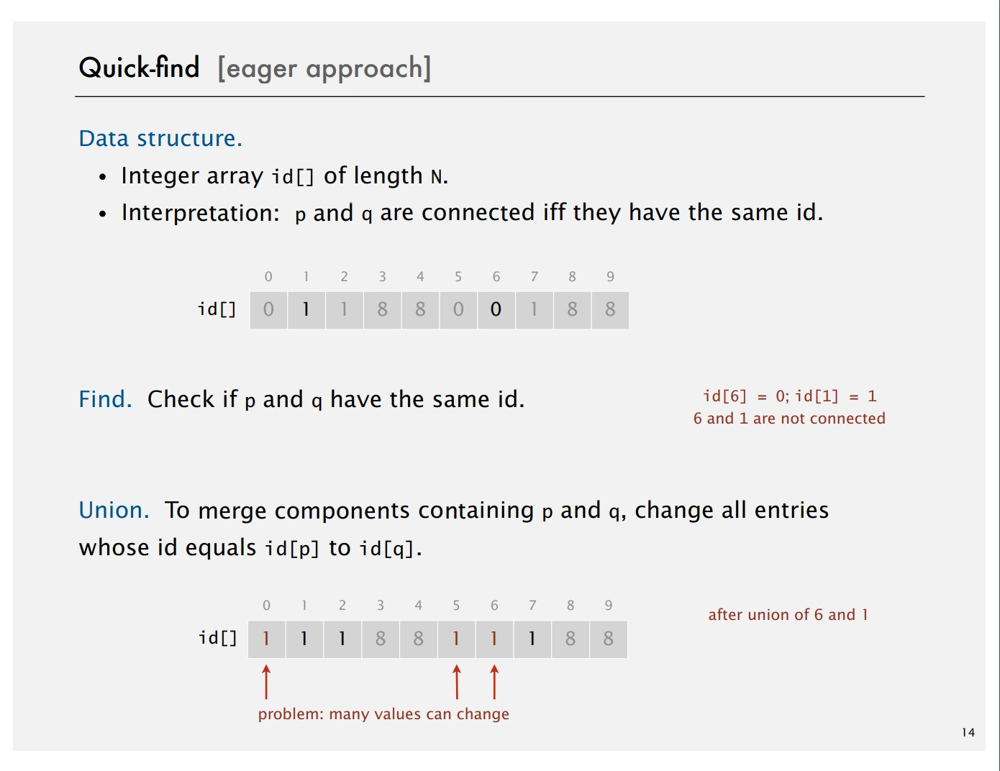

**Quick-find: Java implementation**

```java
public class QuickFindUF
{
	private int[] id;

	// set id of each object to itself (N array accesses)
	public QuickFindUF(int N) {
		id = new int[N];
		for (int i = 0; i < N; i++)
			id[i] = i;
	}

	// check whether p and q are in the same component (2 arrays accesses)
	public boolean connected(int p, int q) {
		return id[p] == id[q];
	}

	// change all entries with id[p] to id[q] (at most 2N+2 array accesses)
	public void union(int p, int q) {
		int pid = id[p];
		int qid = id[q];
		for (int i = 0; i < id.length; i++)
			if (id[i] == pid) id[i] == qid;
	}
}
```

**Expensive costs**

Quick-find costs $N^2$ array accesses to process a sequence of $N$ union commands on $N$ objects.

## Quick union

**Lazy approach**

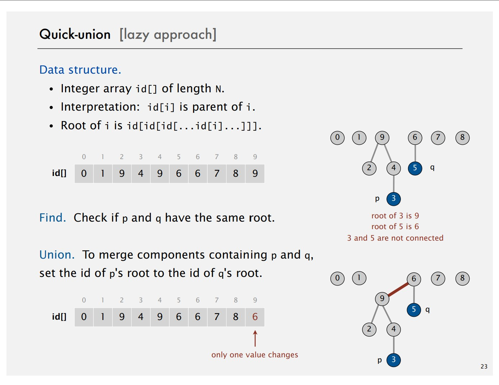

**Quick-union: Java implementation**

```java
public class QuickUnionUF {
	private int[] id;

	// set id of each object to itself (N array access)
	public QuickFindUF(int N) {
		id = new int[N];
		for (int i = 0; i < N; i++) id[i] = i;
	}

	// chase paretn of pointers until reach root (depth of i array access)
	private int root(int i) {
		while (i != id[i]) i = id[i];
		return i;
	}

	// check if p and q have same root (depth of p and q array access)
	public boolean connected(int p, int q) {
		return root(p) == root(q);
	}

	// change root of p to point to root of q (depth of q and p array access)
	public void union(int p, int q) {
		int i = root(p);
		int j = root(q);
		id[i] = j;
	}
}
```

**Costs summary**

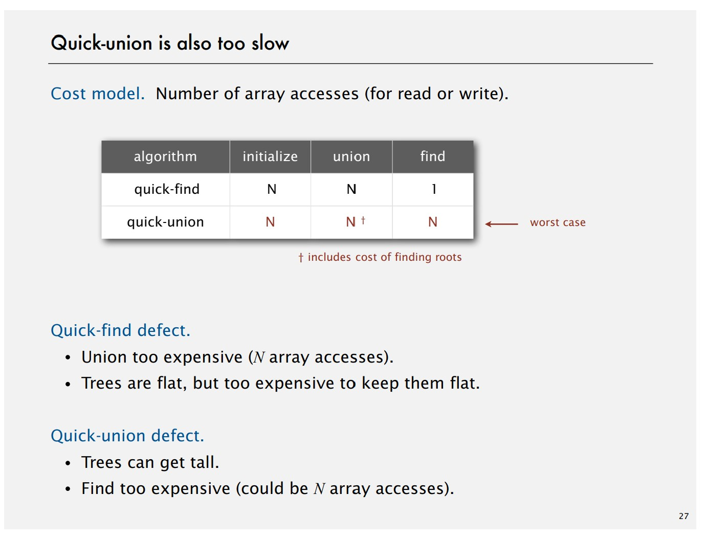

## Improvements 1: weighting

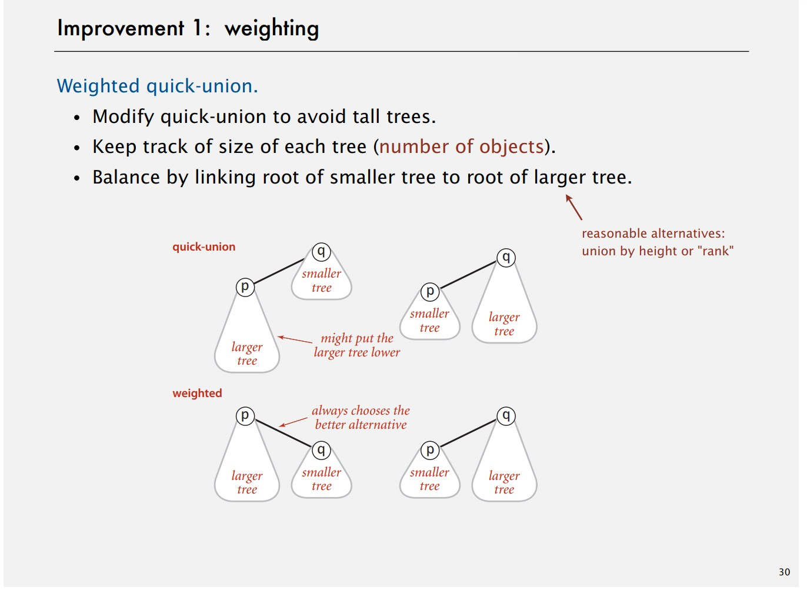

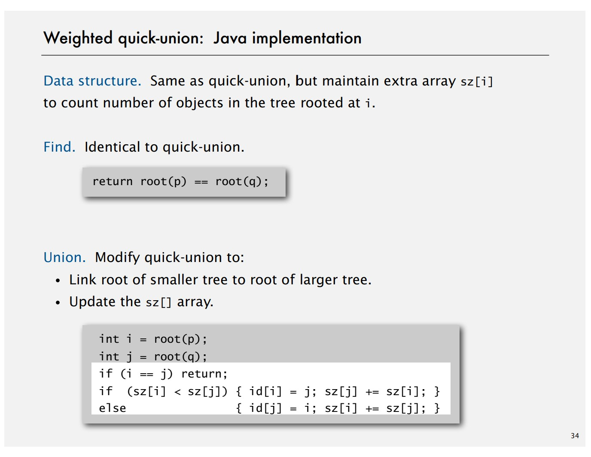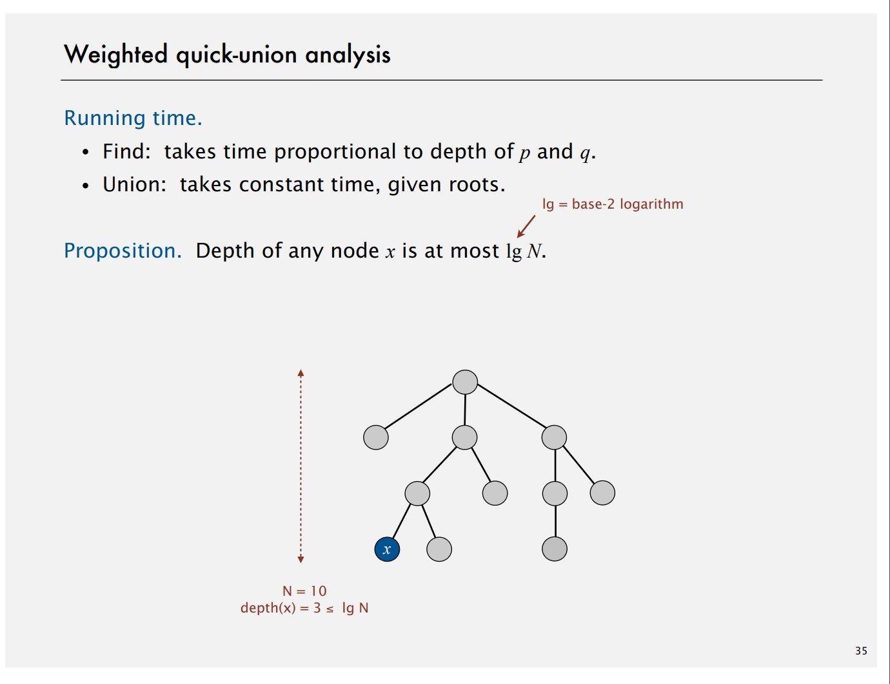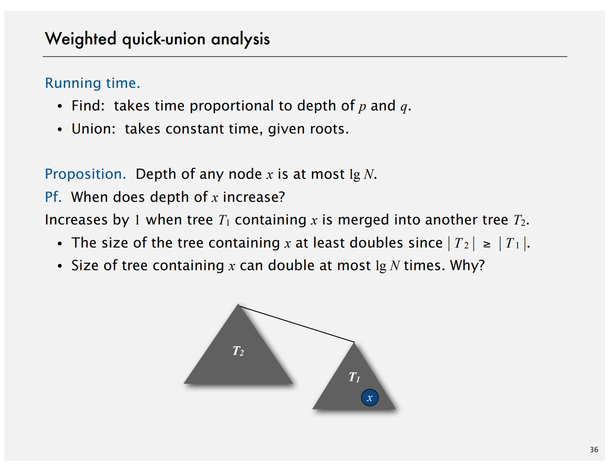

## Improvement 2: path compression

 

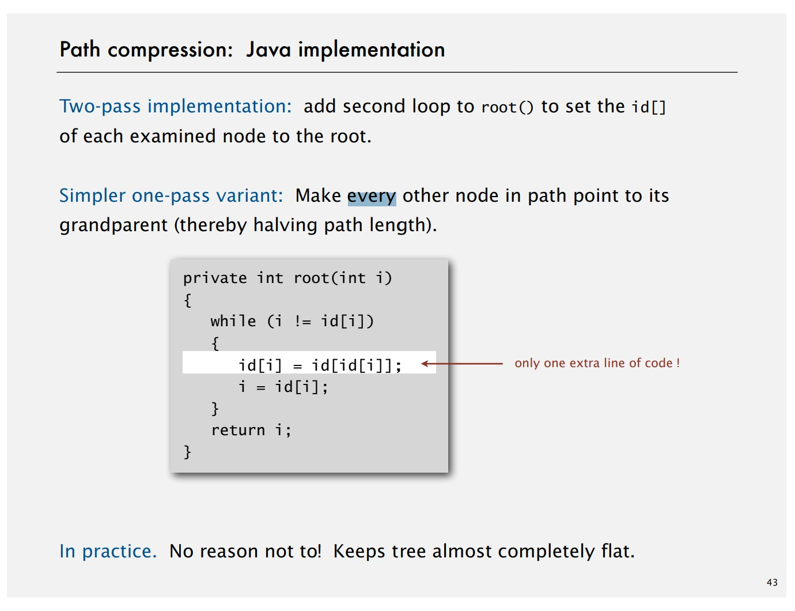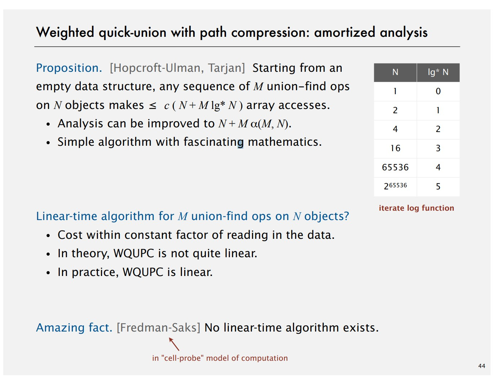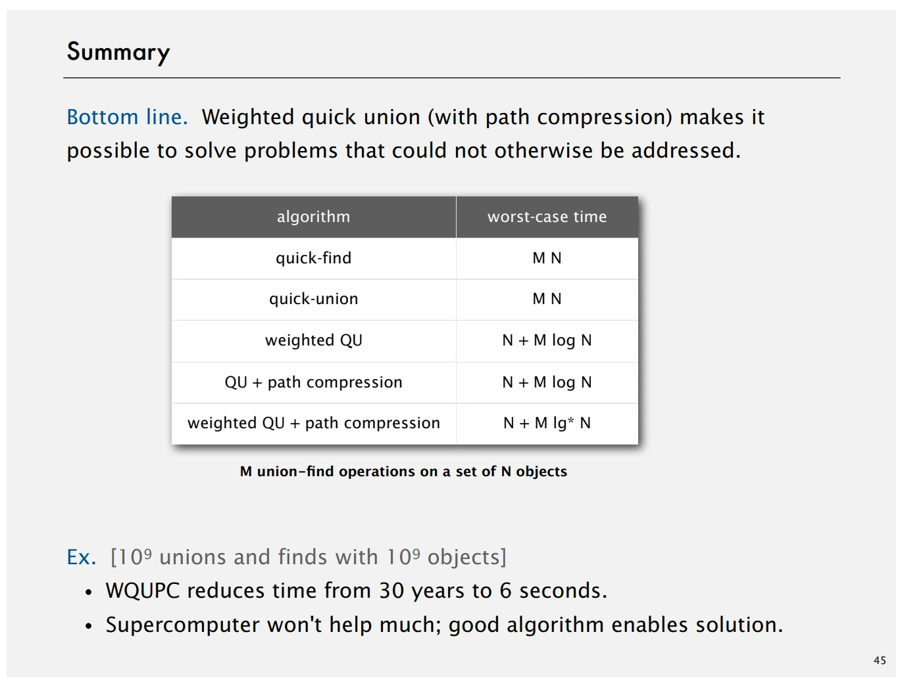

## Application

Refer to Percolation problem.

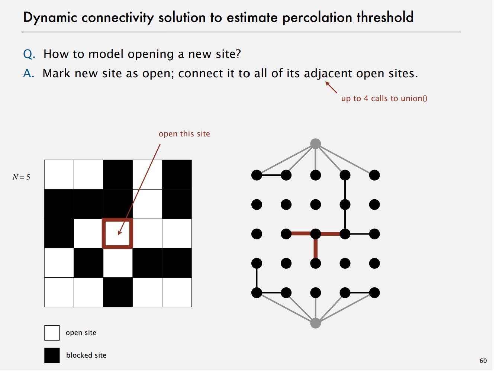
